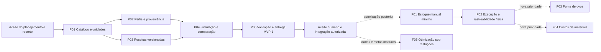

# Plano por verticais — Evolução #413

Data: 2026-10-05. Planejamento [#415](https://devops-lab.tailaf9418.ts.net/issues/415), filho da [Evolução #413](https://devops-lab.tailaf9418.ts.net/issues/413). Estado: **proposto para revisão, sem implementação autorizada**.

Atualização em 06/10/2026: o estado acima é o da elaboração original. O usuário aprovou o conjunto e autorizou P01–P05, executados sob #421/#422–#426. As migrations das verticais foram consolidadas em uma migration aditiva do MVP; definições semânticas ficam versionadas no código, sem seed nutricional. A entrega funcional, os gates, o aceite humano e a autorização posterior de merge do PR #20 estão nas [evidências de validação](../../validation/2026-10-06-catalogo-formulacao-413.md). O encerramento é rastreado na #427. F01–F06 permanecem futuros, sem autorização de execução ou produção.

Contrato de domínio: [especificação](../specs/2026-10-05-producao-insumos-produtos-413-design.md). Entrada futura: [prompt condicionado ao aceite](2026-10-05-producao-insumos-produtos-413-prompt.md).

## 1. Recorte decidido e dependências

O usuário escolheu em 2026-10-05:

1. Primeiro somente catálogo, receitas e simulações.
2. Adiar ponte com ovos; futura fase de estoque começa por entradas manuais.
3. Adiar custos; priorizar quantidades e rastreabilidade.

Portanto **MVP-1 = P01–P05** abaixo. Estoque, lotes físicos, locais, reservas, ordens, custos, importação de ovos e disponibilidade comercial não serão criados antecipadamente. Perfis podem registrar o identificador textual de lote/amostra do laudo, sem lote operacional. Simulação não cria consumo nem comprova adequação nutricional. Não será usado solver nem conjunto de coeficientes/necessidades inventado.

Base deste planejamento: `origin/main` = `37908e22d0ec5110dfd395bc91ac41d6e7a1df2f` (PR #18 integrado). Reconsultar main na implementação e registrar diferença; não tratar o hash como congelamento obrigatório quando existirem avanços legítimos. Preservar untracked locais, em particular `AGENTS.md`, `.gensw/`, `.playwright-cli/`, `.test-output/`, `.verify-output/` e `output/`.

Cada vertical inclui domínio, persistência/API, tela navegável, testes relevantes e documentação; nenhuma vertical termina só com backend compilando. P02 e P03 têm dependências parcialmente independentes, mas este plano não solicita agentes ou execução paralela: organizar sequencialmente conforme integração real e convenções locais.

## 2. Tarefas Redmine propostas para MVP-1

Os identificadores P01–P05 são **rótulos de planejamento, não números Redmine**. Não foram criadas Tarefas executáveis para fases ainda não autorizadas. Ao iniciar um prompt autorizado, criar sua Tarefa própria filha da #413, objetivo/escopo/restrições/aceite, e mover Em andamento antes da investigação. Se um prompt cobrir várias verticais, sua Tarefa coordenadora referencia as Tarefas que realmente forem executadas, evitando tarefas artificiais sem trabalho. Registrar dependências por relação quando útil.

### P01 — Catálogo único e unidades/conversões explícitas

Título sugerido: “Catálogo de Insumos e Produtos com unidades e histórico — #413”. Depende do aceite de D01 e do detalhamento do MVP-1.

Entregar Item com código único, nome, categoria, classe material, capacidades cumulativas, unidade canônica, ativo, versão e histórico. Categorias pequenas com status; unidades iniciais definidas por semântica, sem editor de dimensões universais. Conversões exatas kg/g e L/mL; conversão contextual de embalagem/unidade/volume para massa exige fator/versionamento/fonte e não cria lote físico. Conversão específica de lote fica futura; no MVP-1, contexto de amostra/lote é texto rastreável.

Implementar migration aditiva própria, índices de código normalizado e checks; API autenticada/lista/busca/status/edição/Visualizar; feature frontend de itens e categorias/conversões com retorno preservando filtros. Promover somente “Insumos e produtos” no menu quando telas reais estiverem prontas. Nenhuma mudança nos contratos de Animal/Propriedades/Caixa.

Aceite:

- Item “ingrediente moído” admite ser produzido e consumido, sem dois cadastros; embalagem não exige nutrientes.
- Busca/paginação completa, código duplicado retorna conflito inclusive em corrida, item inativo consultável e bloqueado em novo uso.
- L → kg e un → kg sem fator retornam incompatibilidade; nenhuma densidade/peso padrão escondido.
- Unidade canônica após uso publicado é imutável; alterações de cadastro/status geram história com autor.
- Precisão/string decimal e contagem inteira verificadas; nenhum saldo/preço/local/fato físico criado.

Testes: regras de unidade e normalização, duplicidade concorrente PostgreSQL, versão esperada, autenticação, paginação/escaping, detalhe/status/retorno de filtros e teclado. Gates de vertical: testes direcionados, frontend test/lint/build quando alterado, backend build e diff --check.

### P02 — Perfis nutricionais versionados e proveniência

Título sugerido: “Perfis nutricionais verificáveis e versionados — #413”. Depende de P01.

Entregar definições prioritárias de componentes (P0 da especificação) com códigos e metadados; suporte aos P1 somente com semântica definida, sem dezenas de campos obrigatórios. Perfis e valores conhecidos/zero/desconhecidos/não aplicáveis, origem medida/declarada/estimada, fonte/método/base/unidade/espécie/fase/preparação/amostra. Rascunho publicável, nova versão explícita e inativação conservando história. Registrar fonte por URL/identificador, sem importador ou upload obrigatório.

Migration somente de definições/perfis/observações, sem FK de lote operacional. API/telas permitem consultar versões e distinguir base natural/MS e frações. Não atribuir energia de rótulo humano a EM animal. Publicação é imutável; editar published retorna conflito. Não inferir “medido” de um número digitado.

Aceite:

- Dois perfis do mesmo item coexistem por origem/contexto; seleção não usa “mais recente” silenciosamente.
- Umidade desconhecida impede conversão MS; valor zero explícito é diferente de null; limite de detecção não vira zero.
- Fibra bruta/FDN/FDA/alimentar e energias EB/ED/EM/EMAn não são intercambiáveis; fonte por porção requer massa/denominador.
- Item não alimentar pode existir sem perfil; item alimentar incompleto é válido como cadastro, com lacuna visível.
- Histórico publicado permanece reproduzível após renomear/inativar item ou publicar perfil novo.

Testes: estados/versões/unicidade, origem e qualificadores, base/unidade/faixas, umidade/MS coerentes, aplicabilidade energética, API autenticada e conflito de publicação concorrente PostgreSQL; UI campos semânticos/consulta de fonte/erros/status.

### P03 — Receitas versionadas, escalonamento e dependências

Título sugerido: “Receitas e sub-receitas versionadas sem ciclos — #413”. Depende de P01; integra perfis de P02 quando usados, sem obrigar nutrição a toda receita.

Entregar receita/rascunho/versão publicada, entradas alimentares/incorporadas/embalagens/consumíveis, saídas e perdas esperadas, lote de referência, comportamento de escala, etapas/observações e tipo MisturaSimples/Processamento. Escolha fixa de versão/saída da sub-receita; expansão limitada, sem orquestrar produção. Etapas textuais não prescrevem segurança alimentar.

API/lista/editor/Visualizar com versões e comparativo do conteúdo; adicionar “Receitas” em Produção — transformações quando disponível; manter Produção agrícola/animal com fronteiras próprias. Migração não cria Ordem/lote/saldo.

Aceite:

- Grão→moído e moído→ração compartilham ItemId do intermediário; receitas distintas preservam identidade.
- Receita de conserva inclui ingrediente e embalagem sem exigir nutriente da embalagem; líquido/drenado/bruto só dados esperados/documentais neste MVP.
- Percentuais alimentares totalizam 100 exatamente; embalagens não entram nesse percentual. Grandezas incompatíveis não são somadas.
- Escala 2× dobra linhas variáveis, preserva fixas por lote, explica frações de unidades e exige ajuste antes de publicação válida.
- A→A, A→B→A e dependência transitiva da mesma receita são rejeitadas; grafo acíclico e limite de expansão documentado.
- Publicada imutável, nova revisão explícita; inativação impede novo uso e conserva história. Receita não afirma disponibilidade física nem cria ordem.

Testes: percentuais/arredondamento/inteiros, mesma identidade em etapas, seleção de saída/rendimento de sub-receita, ciclo/limites, versão histórica, inativação concorrente/publicação com PostgreSQL e UI de escalonamento/Visualizar.

### P04 — Motor de simulação manual e comparação por metas

Título sugerido: “Simulação nutricional reproduzível e comparação por metas — #413”. Depende de P02 + P03.

Entregar cálculo decimal no backend, normalização BN/MS e kcal termoquímica/MJ mantendo modalidade; snapshot de linhas/perfis/conversões/receita/metas/algoritmo. Simulação pode usar variação manual sem alterar receita publicada: salvar variação no snapshot e oferecer criação explícita de novo rascunho. Persistir simulações/comparações com idempotência, não rascunho temporário como fato físico.

Comparar proteína/energia/fibra conforme componente/contexto, metas min/max/faixa, espécie/fase e origem livre/técnica com fonte. Completo/Parcial/Indeterminado e origem estimada são dimensões separadas. Sem solver, custo ou saldo. Processamento aceita perfil de saída explícito ou estimativa simples por parâmetro documentado para saída única; quando dados faltarem, mostrar “não calculável”. Não implementar modelos multissaída de retenção avançados.

Aceite:

- Reproduzir os exemplos F1/F2 da especificação com contribuições, BN/MS e 10,4 MJ/kg ≈ 2485,6597 kcal/kg.
- PB de B ausente mostra contribuição conhecida/cobertura de 60%, sem meta PB atingida e sem usar zero.
- Umidade ausente bloqueia MS, mas não apaga BN calculável; bases/contextos incompatíveis exibem não comparável.
- Detectar min>max, exemplo impossível 450 g/kg PB e limite de inclusão; não afirmar inviabilidade global sem prova.
- Dados estimados/excluídos pela política de meta tornam lacuna explícita; maior proteína não produz selo de dieta balanceada.
- Processamento 100→90 kg só usa retenção/perfil selecionado e fica estimado; conserva drenada não recebe perfil do conteúdo total automaticamente.
- Alterar item/perfil/receita depois deixa simulação antiga intacta; retry idempotente retorna mesma SimulacaoId.

Testes: motor decimal e overflow, conversão/denominadores, faltantes, metas, sub-receitas sem dupla contabilização, rendimentos/perdas, API e snapshots/idempotência concorrente PostgreSQL; UI comparação/expansão/fontes/avisos e nova variação explícita.

### P05 — Integração, preservação de dados e entrega revisável

Título sugerido: “Validar e entregar MVP-1 de catálogo e formulação — #413”. Depende de P01–P04; acompanha verificação de cada vertical.

Consolidar migrações, SQL revisável e documentação operacional do que existe. Em base isolada nova e cópia da main anterior: aplicar migrations **somente nessa validação autorizada**, comprovar preservação de IDs/contagens/valores de Animal/Filiação/Ciclos/Proles/ovos/Propriedades/Caixa. Conferir que tabelas/rotas de fases futuras não foram criadas. Não aplicar em banco compartilhado sem escopo explícito de autorização.

Executar gates finais §4, verificar autenticação/navegação e fluxos desktop/celular. Commit/push/PR revisável com tarefa e evidências; sem merge/publicação automática. Tarefas ficam Em validação até aceite/revisão/merge pertinentes. Atualizar README/arquitetura/navegação apenas para recursos realmente entregues.

Aceite: todas as verticais operantes e rastreáveis, exemplos e invariantes testados, módulos anteriores preservados, CI e limitações registrados, revisão humana pendente explicitamente. Não tratar CI verde como aceite de nutrição de uma receita real.

## 3. Matriz de testes de maior risco

| Cenário solicitado | MVP-1 — resultado esperado / teste | Fase física futura |
| --- | --- | --- |
| Unidades incompatíveis | Domain/Application: L + kg sem densidade e un sem massa bloqueiam total nutricional; API erro/resultado parcial conforme campo. | Confirmar somente com conversão aplicável e quantidades canônicas válidas. |
| Nutrição ausente | Motor: null distinto de zero; completude por nutriente; meta indeterminada; UI explica linha faltante. | Falta nutricional não gera saldo fictício; execução pode registrar reais sem afirmar meta nutricional. |
| Versões históricas | Publicar perfil/receita v2, renomear/inativar item: simulação v1 inalterada; snapshot inclui fonte e algoritmo. | Execução congelada; perfil do lote escolhido, sem recalcular retroativamente. |
| Metas impossíveis | min>max rejeitado; máximo convexo sintético detectado; contexto energético incompatível; não declarar globalmente impossível sem prova. | Estoque insuficiente bloqueia início/extra real, sem alterar meta para acomodar saldo. |
| Rendimento/perdas | Quantidades esperadas por dimensão; 100→90 com retenção explicitada; sem hipótese não calcular saída processada. | Planejado×real, perda total, balanço incompleto justificado, lotes/resultados atômicos. |
| Mesmo item entrada/saída em etapas | Item moído permanece único; sub-receita consumida como intermediário não expande consumo ancestral duas vezes. | Produção A cria lote B; produção C consome B e preserva genealogia. |
| Ciclos de receita | A→A, A→B→A e cadeia longa/expansão excessiva rejeitadas ao publicar/simular. | Não consumir o lote ainda não criado na mesma confirmação; grafo dos eventos preservado. |
| Lote vencido/inativo | Não há lote físico no MVP-1; só perfil/receita/item inativo bloqueado em novo uso, história visível. | Início/consumo bloqueados; inativação concorrente x confirmação; segregação/compensação Admin sem liberação automática. |
| Dupla confirmação | Não há confirmação física; publicação duplicada/idempotência de simulação são testadas. | Duas chaves na mesma ordem produzem uma confirmação; replay retorna resposta original. |
| Consumo concorrente | Fora do MVP-1; publicação/código/versão/idempotência concorrentes em PostgreSQL. | Barreiras com duas ordens no mesmo saldo; só disponibilidade suficiente passa; saldo/reserva não negativos. |
| Rollback | Falha ao gravar linhas/snapshot/auditoria: nenhuma versão/simulação parcial. | Falha após débito antes da saída: consumo/reserva/saídas/lotes/custo futuro/auditoria/idempotência todos revertidos. |
| Correção após consumo da saída | MVP-1 não produz fato físico; snapshots antigos imutáveis e nova simulação explícita. | Reversão bloqueada após qualquer saída/reserva/transferência/venda; anotação ou ajuste presente justificado sem recompor ancestral. |

Testes de banco/concorrência usam PostgreSQL real, com fixture efêmera e barreiras, não somente Task.WhenAll nem SQLite/in-memory. Separar testes de regra pura dos de lock/constraint. Valores sintéticos são fixtures rotuladas, nunca seed operacional.

## 4. Gates futuros e sequência de aprovação

O planejamento documental teve inspeção e verificação própria, não execução/build da aplicação. Gates abaixo são **futuros**:

1. Antes de alterar código: aceite humano verificável do MVP-1, AGENTS local, Tarefa Redmine Em andamento, main atual e árvore revisadas, branch `codex/` própria. Se for continuação da mesma entrega autorizada, respeitar tarefa/branch existentes sem duplicação gratuita.
2. Por vertical: testes de regras e contratos alterados, migrations em banco isolado quando aplicável, build backend, testes frontend/lint/build se UI mudou; diff --check. Não escrever testes que só espelhem detalhes irrelevantes.
3. Integração: `dotnet restore GenSW.sln`; `dotnet build GenSW.sln --configuration Release --no-restore`; `dotnet test GenSW.sln --configuration Release --no-build`. Verificar executáveis PostgreSQL e usar as fixtures/padrões do CI; nenhuma senha/log secreto versionado.
4. Frontend em `src/Frontend/GenSW.Web`: `npm ci`, `npm test`, `npm run lint`, `npm run build`. Não introduzir dependência de solver ou biblioteca de decimal no cliente sem necessidade real; cálculos canônicos ficam no servidor.
5. Navegador: HTTPS/autenticação/reautenticação, cadastro/edição/status/detalhe de item, fonte/perfil, publicar/revisar receita, sub-receita/ciclo, escala, F1/F2 e dados ausentes, comparação BN/MS/energia incompatível, acesso direto a histórico/inativo, filtro/página no retorno, 401/403/404/409, teclado, desktop e tela estreita. Inspecionar console e pedidos de API, sem registrar credenciais.
6. Regressão: Animal/Filiação/pedigree, Cruzamentos/Ciclos/Proles, ovos individuais, Propriedades/vínculo e Caixa permanecem operantes; todos os testes existentes devem passar. Navegação agrícola/animal/genética não promovida por engano.
7. Revisão de diff/migrations/escopo, evidências e segredos; commit específico e push. PR com problema/comportamento final e validações reais, CI Backend/Frontend aprovados. Não confundir teste não executado com PASS.
8. Atualizar Redmine com base/branch/commit/push/PR/validações/pendências e mover Em validação. Aceite manual/revisão/merge/publicação dependem da autorização correspondente; sem conclusão automática.

Para fases físicas, ampliar gates para falta de saldo, expiração/inativação durante reserva, execução parcial/perda total, dupla confirmação com mesma/outra chave, timeout/retry, rollback com falha injetada, transferência, reversão antes/depois de consumo e reconciliação livro/projeção. Não basta preservar testes do MVP-1.

## 5. Fases posteriores — propostas, sem autorização

| Rótulo / Tarefa futura sugerida | Dependência | Entrega e aceite resumidos |
| --- | --- | --- |
| F01 — Estoque mínimo com entradas manuais e lotes | MVP-1 aceito; nova autorização e revalidação do §9 da especificação | Locais/Propriedade opcional, lote/situação/validade declarada, abertura/entradas/transferência/saída/consumo interno, ledger e projeções sem negativo. Sem ponte de ovos nem custos. Auditoria, versões, idempotência, SQL/migrations e navegador. |
| F02 — Ordens, reservas e execução de transformação | F01 entregue e aceito | Planejado/real, reserva explícita, consumo/saídas atômicos, perdas, intermediários, genealogia, reversão restrita, anotação/ajuste; custos ainda ausentes. Testes PostgreSQL de concorrência/rollback/correção. |
| F03 — Entrada explícita de ovos existentes | F01/F02 conforme fluxo, validação da semântica de um registro = uma unidade e nova autorização | Ponte única por ProducaoOvoId, snapshots e alerta de edição posterior; nenhuma duplicação/importação automática ou mudança do contrato Animal. Entradas manuais já existentes exigem conciliação explícita. |
| F04 — Custos de materiais e rateio de coprodutos | F02 + prioridade expressa do usuário | Preço/custo por fonte/lote, faltantes, rateio manual com soma exata e perda; estimado/apurado separado. Nenhum movimento de caixa automático. |
| F05 — Otimização assistida sob restrições/custo | Dados/metas/aplicabilidade maduros; custos quando objetivo econômico; nova autorização | Avaliar solver, viabilidade, limites, disponibilidade e explicação; validar contra exemplos de solução conhecida. Não declarar dieta adequada só por ótimo matemático. |
| F06 — Processamentos avançados e módulos comerciais | Demanda real e desenho próprio | Retenção multissaída, WIP/consumo parcial, recebimento por compra, saída por venda, requisitos legais/rotulagem/segurança por contexto. Integrações não alteram retroativamente versões/caixa. |

Não estimar horas fechadas antes de confirmar contratos detalhados das novas verticais. Maior risco do MVP-1 é qualidade/semântica dos dados e cálculo parcial; maior risco da fase física é concorrência/rastreabilidade/correção. Dividir entrega preserva utilidade do formulador sem inventar estoque.

## 6. Tratamento documental e pendências deste planejamento

Somente documentos novos em `docs/superpowers/specs` e `docs/superpowers/plans`, seguindo a organização já usada no repositório. Prompt original em `output/planning` foi lido integralmente e permanece local. `AGENTS.md` não será versionado. Não foram alterados src/tests, aplicadas migrations, iniciados serviços ou publicada aplicação.

Validar links locais, referências de código/base, cálculos sintéticos, consistência de D02–D04/escopo e diff --check antes de commit documental. Commit/push documental e PR draft servem para revisão; registrar os IDs e estado reais na Tarefa #415. Qualquer limitação dessas operações deve ser registrada, sem alegar que foi feita.

Pendências humanas: revisão dos detalhes D01/D07/D08 e aceite de MVP-1; escolhas físicas D05/D06 serão revalidadas em fase posterior. Os rótulos P/F não são Tarefas já criadas. A entrega deste planejamento não implementa nem autoriza as verticais e permanece Em validação.
