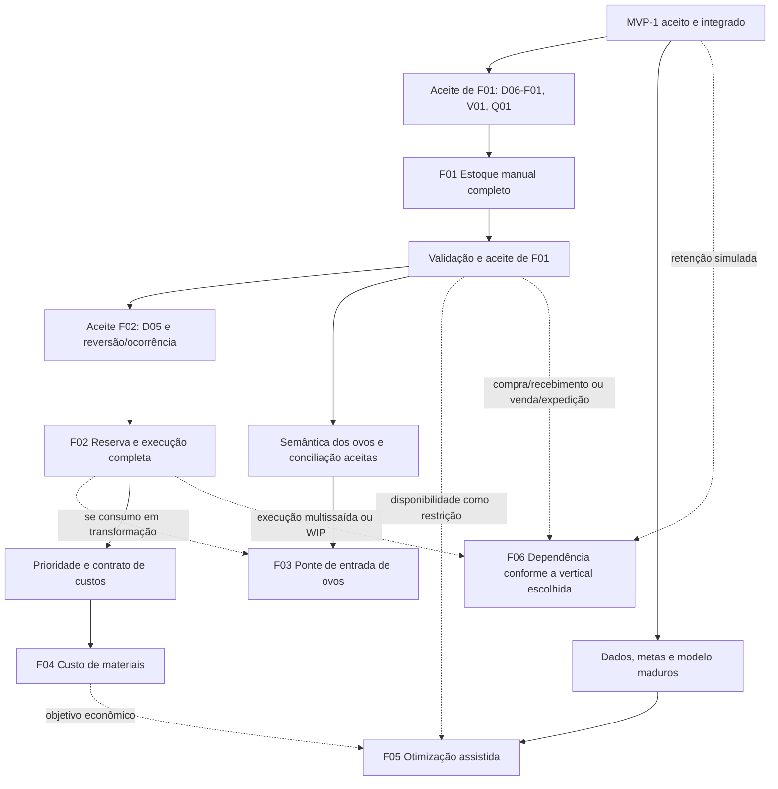

# Plano executável da continuidade F01–F06

Data: 07/10/2026, America/Sao_Paulo. Evolução [#430](https://devops-lab.tailaf9418.ts.net/issues/430), planejamento [#431](https://devops-lab.tailaf9418.ts.net/issues/431). Base `origin/main` `dda69509c01b4a27bc6b6b5c3f2add842c441a53`, branch documental `codex/431-planejamento-f01-f06`. **Somente planejamento autorizado.** Este plano organiza execução futura por gates; não autoriza código, migrations, merge ou produção.

Contrato: [especificação F01–F06](../specs/2026-10-07-continuidade-f01-f06-430-design.md). Entrada futura: [prompt executável condicionado de F01](../../../output/planning/prompt-implementacao-f01-430.md). Referências históricas: [plano P01–P05](2026-10-05-producao-insumos-produtos-413-implementation.md), [operação integrada](../../operations/catalogo-formulacao.md) e [aceite MVP-1](../../validation/2026-10-06-catalogo-formulacao-413.md). Não executar novamente P01–P05.

## 1. Dependências e gates de autorização



F03 não exige artificialmente todas as fases anteriores: entrada simples usa F01; transformação usa também F02. F05 pode ter objetivo não econômico sem F04, e não é obrigatória depois de custos. F06 é horizonte de alternativas, não entrega monolítica. Pode-se autorizar desenvolvimento encadeado, desde que a mensagem humana explicite recortes/gates; a aceitação anterior nunca é presumida. Não estimar horas fechadas antes de contratos.

Rótulos F01–F06 e passos abaixo **não são IDs Redmine**. Na execução de um prompt autorizado, criar sua Tarefa própria sob #430, objetivo/escopo/restrições/aceite e Em andamento antes da investigação técnica. Criar outras tarefas somente para trabalhos efetivamente autorizados/executados. Não reutilizar #431 como implementação nem reabrir #413. Consultar transições permitidas e confirmar mudança por leitura; Em validação ao entregar com aceite/revisão/merge pendentes.

## 2. F01 — sequência pronta para execução após aceite

Cada passo é parte da mesma vertical de F01; o resultado final inclui Domain/Application/Infrastructure/API, React navegável, testes e operação. Passos técnicos não são entregas de backend isolado ao usuário. Identificar/investigar padrões antes de editar; alterações mínimas e sem framework genérico de módulos.

### F01.0 — Baseline e ambiente

1. Confirmar aceite da especificação F01 e suas decisões D06-F01 (papéis), V01 (validade não informada) e Q01 (quantização/resíduo), registrando a mensagem humana no Redmine. Se o usuário ajustar alguma decisão, atualizar contrato/plano antes do código dependente; não pedir novamente aceite já explícito.
2. Ler AGENTS local integralmente e criar a tarefa executável em #430; usar API Redmine com variável `REDMINE_API_KEY`, nunca expor chave. Confirmar papel dedicado Codex do projeto, sem alterar workflow/papéis globais.
3. Fetch/reconsultar main e worktrees; branch `codex/<nova-tarefa>-f01-estoque` a partir da main atual, reutilizando checkout adequado ou isolamento gerenciado. Não usar branch integrada de #421 nem trocar checkout de homologação ativa.
4. Ler integralmente documentos F01–F06/contrato vigente/validação e instruções ambientais. Reidentificar portas/PIDs/versão/banco/finalidade antes de qualquer start/stop. Guardar metadados seguros, sem command lines com connection strings ou caminho privado de imagens.
5. Inventariar migrations atuais/pendentes, sem aplicar na base compartilhada. Preparar PostgreSQL efêmero/base isolada e artefatos de build separados se DLLs em uso. Fixture somente em base descartável identificada; não seed de estoque/conta no banco do usuário.

Saída verificável: tarefa e branch corretas, baseline/limites/ambiente registrados. Gate: nenhuma alteração funcional ou migration compartilhada antes do aceite; nenhuma perda de untracked locais.

### F01.1 — Regras e persistência físicas

Arquivos novos propostos, com nome final seguindo convenção local:

- `src/Backend/GenSW.Domain/Inventory/`: LocalEstoque, LoteMaterial, PosicaoEstoque, Evento/MovimentoEstoque, Historico/ComandoEstoque e regras de quantidade/elegibilidade/normalização. Domain não depende de EF/HTTP.
- `src/Backend/GenSW.Application/Inventory/`: contratos de consultas/comandos/prévia, serviço e interfaces próprias. Expor comando específico por operação e retornos imutáveis; versão/status sem edição arbitrária.
- `src/Backend/GenSW.Infrastructure/Inventory/`: repository/mutation scope, leitura consistente, guards de persistência e hash canônico tipado. Considerar `IsConcurrencyToken` nas revisões novas, reforçando o advisory, sem reformular catálogo inteiro.
- `src/Backend/GenSW.Infrastructure/Persistence/`: configuração Inventory e DbSets; migration aditiva somente F01, mantendo tabelas antigas. Composição DI nas camadas existentes.

Implementar modelo da especificação §§3–4: Local com contexto opcional; lote vazio com identidade/fonte/responsável/validade/situação e referências explícitas; posição zero persistente; ledger append-only com sequência, projeção e idempotência próprios. Cadastro do lote fixa unidade por `Item.FixUnit()` e audita, sem Up que altere todos os itens. Não introduzir ExigeValidade por classe implícita nem coluna de custos/reservas.

Quantidades string invariante até 14+6; normalize kg/g/L/mL e conversão contextual direta/recíproca à canônica. Domain calcula em decimal/checked, mostra valor calculado/normalizado/resíduo. ToEven a seis casas exige aceite explícito; un fracionária/quantização zero/overflow recusados. Reutilizar validações compatíveis, sem modificar escala/nutrição publicadas do MVP.

Migration: sete tabelas físicas (§9 da spec), códigos/posição/idempotência/evento/ordinal/abertura únicos; FKs Restrict; quantidades/não negativo/inteiros/unidades/estados; guards imutáveis e unidade física coerente; constraint trigger deferred das duas pernas de transferência. Numeric com escala não prova rejeição de input excessivo; testar política antes do EF e guards efetivos separados.

Gate: regras puras e SQL em PostgreSQL passam para normalização/inteiros/validade/status/fixação de unidade/imutabilidade/unicidade. Tabelas F02–F06 continuam ausentes.

### F01.2 — Transações, comandos e leitura

Implementar protocolo catálogo `(413,421)` → físico `(430,1)` → rows em ordem tipo/ID; timeout 5 s, conflito seguro, rollback/dispose/limpeza de tracking após falha. Escritas de catálogo existentes continuam no primeiro lock; física não chama mutação de Caixa/Animal/Genealogia. Referência ativa de Propriedade em novo vínculo e usuário responsável conferidas consistentemente; usar row lock compartilhado quando necessário, sem lock genealógico.

Ordem de execução: autenticação/papel → chave/hash/locks → reconsultar usuário ativo/papéis atuais → replay original → revisões/referências atuais → cálculo/aceite/saldo → ledger/projeção/histórico/resposta → commit único. Reutilizar GetCurrentUserAsync: claim Admin em JWT anterior não prova papel atual. Canonical hash apenas para campos semânticos, preservando códigos/fontes textuais. Abertura única por posição sem movimento anterior; recebimento preserva lote/origem; transferência/segregação/retorno na canônica sem reconversão; saída com destino/motivo; consumo exige UsoInterno; ajuste recebe contagem alvo e calcula delta; segregação/retorno/descarte são comandos Admin próprios.

Situação/datas/referências Admin não apagam fatos. Recebimento vencido/pendente em Segregação bloqueado; ordinário recusa vencido/inativo/Bloqueado. Permitir ajuste/retirada excepcional apenas como tratamento explícito. F01 não tem estorno de transformação ou evento genérico; erro recebe ajuste presente com evidência.

Consultas paginadas RepeatableRead/corte; filtros/whitelist/desempate, histórico por ID, saldos por unidade e motivo de indisponibilidade, eventos agrupados. Reconciliação livro/projeção somente leitura, sem recomputar do histórico Animal/Financeiro nem persistir correção. Timeout de leitura 3 s; não alegar resultado completo após timeout.

Gate PostgreSQL: transferência/crédito/débito/auditoria/command atômicos; duas sessões realmente bloqueadas disputam último saldo; mutação de catálogo versus física sincronizadas; replay depois de metadados alterados devolve original; chave divergente conflito; virada de validade controlada; projeção confere livro no corte.

### F01.3 — API autenticada e contratos

Criar controller(s)/filter/contratos em `src/Backend/GenSW.API` e registrar serviço. Rotas `/api/v1/estoque` conforme spec §5; políticas de sessão e Admin com claim de autor server-side e revalidação de papéis atuais no serviço. Proibir falsificação de AutorId; responsável existente não autoriza execução no lugar de outro usuário. Como não há lista pública na main, criar GET `/estoque/responsaveis` e `/{id}` mínimos id/nome/ativo, paginação/busca e histórico inativo, sem modificar identidade/auth ampla. Novo fato exige responsável ativo; prévia exige papel da operação. Sequência/corte bigint em strings.

Implementar GETs individuais de Local/Lote/Posição/Evento e históricos, listas, prévias read-only e cada comando. Novas escritas obrigam chave e revisões; respostas trazem IDs/quantidades strings/corte/revisões/status e Location quando criado. ProblemDetails com código estável e erro por causa; sem SQL/secrets. Replay preserva corpo/status original antes de validar estado atual, mantendo autorização atual.

Gate API: 401/403/404/400/409; usuário comum versus Admin em todas as operações, direto por URL; campos obrigatórios/limites/conversões e decimais equivalentes; revisão 0 de posição ausente, mesma/divergente chave e referências inativas consultáveis. Prévia não grava ledger/saldo/command.

### F01.4 — Feature React e vertical operante

Criar `src/Frontend/GenSW.Web/src/features/inventory/` com DTOs/parsers rigorosos, serviços HTTP/hooks, páginas listas/detalhes/formulários/comandos/prévia. Reutilizar `shared/http/httpClient`, `shared/details`, retorno de filtros e seleção paginada; não criar cliente de auth independente.

Adicionar rotas da spec §6 dentro de ProtectedRoute e promover somente Estoque em `features/auth/navigation/modules.ts`. Locais/Lotes com Visualizar separado de Editar; Saldos/Movimentos/reconciliação; operação e comandos Admin em rotas próprias. Resolver labels de IDs históricos fora da página; novos usos elegíveis, sem truncar catálogo ao primeiro page. Saldo/quantização vêm do servidor, não `Number` no cliente.

Fluxo completo: criar local/lote vazio → recebimento (ou abertura Admin) → consultar posição/livro → prévia de transferência → confirmar → histórico e destino; consumo/saída/ajuste/segregação/descarte e conflitos. Preservar chave/payload no retry depois de rede, criar nova chave somente quando payload alterado e nova prévia. Mostrar disponibilidade observada/corte; não alegar reserva pela prévia.

Gate UI: proteger rotas; Admin/comum; seleção histórica/paginação, detail sem formulário, filtros/página/reload, preview/resíduo, erro de conflito sem perder formulário, sessão/401/403/404/500/retry e teclado. Desktop/celular com scroll interno e labels/foco; não somente unit tests de componentes.

### F01.5 — Migration, regressão e documentação operacional

1. Criar `InventoryMigrationTests` em padrão existente: base nova e cópia da main imediatamente anterior, fixtures dos módulos prévios, captura de IDs/contagens/refs/valores de **todas** as tabelas antigas antes de migration, comparação depois; novas físicas vazias. Só depois inserir fixtures F01.
2. Adaptar `FormulationMigrationTests` para seu alvo histórico `20261006220939_AddCatalogAndFormulation`, preservando comparação integral e assertiva de que o MVP-1 não criou estoque. Não remover a proteção para fazer latest passar. Teste F01 afirma ausência de Reserva/Ordem/PonteOvo/Custo.
3. Gerar SQL idempotente/revisável em `docs/operations/sql`, da migration real de origem até latest incluindo todas as pendências. Não aplicar em banco compartilhado. Backup/restore isolado e contagem/hash do baseline devem preceder fixtures.
4. Documentar `docs/operations/estoque.md`: permissões, lotes/situação/validade, unidade/quantização, livro/projeção/reconciliação, idempotência/timeout, limites, migração/recuperação e ambiente. Atualizar README/arquitetura somente para recursos realmente implementados; nada de ordens/custos futuros como disponíveis.
5. Evidência em `docs/validation/<data>-estoque-<tarefa>.md`, com comandos/resultados reais, PostgreSQL/barreiras/falhas/preservação, UI/auth/imagens e limitações. Logs privados ficam locais, screenshots versionáveis só de fixtures não sensíveis.

Gate: nenhum conteúdo anterior alterado, invariantes e guards realmente exercitados, base compartilhada/volume privado preservados. Comparação de schema/dados não é substituir o acervo por fixture.

### F01.6 — Validação final e entrega

Backend na raiz, com caminho de artefatos externo quando necessário:

```powershell
dotnet restore GenSW.sln
dotnet build GenSW.sln --configuration Release --no-restore
dotnet test GenSW.sln --configuration Release --no-build
```

Frontend em `src/Frontend/GenSW.Web`:

```powershell
npm ci
npm test
npm run lint
npm run build
```

PostgreSQL real com binários/fixtures do CI, `GENSW_TEST_POSTGRES_BIN` externo; não SQLite/in-memory como prova de locks/constraints. Inspecionar TRX e falhas/ignorados; teste não executado nunca PASS. Depois dos gates locais apropriados, browser HTTPS/session/refresh e fluxos completos com desktop 1440×1000 e estreito 390×844, console/requisições, teclado e preservação dos módulos anteriores. Se API isolada precisar iniciar/reiniciar, identificar ambiente e fornecer explicitamente `Images__PrivateRoot` do volume existente; validar foto privada sem divulgar caminho/dados.

`git diff --check`, inspeção de escopo/secrets/migrations, commit específico da tarefa, push, PR revisável anexado ao chat e CI Backend/Frontend aprovado. Registrar base/branch/commits/push/PR/checks/ambiente/limitações/pendências na tarefa; mover para Em validação e confirmar por leitura. Entregar para aceite humano. Não merge/deploy/migration compartilhada nem encerrar com aceite pendente. Uma implementação sem frontend ou com CI vermelho exige correção ou pendência explícita; não afirmar vertical concluída.

## 3. Matriz de verificação por camada F01

| ID | Camada / risco | Cenário e observação exigida |
| --- | --- | --- |
| T01 | Domain — unidade/precisão | kg/g, L/mL, par direto/inverso por divisão (fator3, 3kg→1un exata), contexto diferente, ausência de fator, strings/expoente/vírgula/overflow; limites 14+6; un inteiro; zero após ToEven. |
| T02 | Domain — resíduo | Prévia calcula 0.0000015 kg → 0.000002/resíduo negativo; sem aceite falha; aceite divergente falha; valor íntegro não precisa aceite. Transferência não quantiza de novo. |
| T03 | Domain — estados/datas | Liberado/Bloqueado/Encerrado/ativo, sem validade versus vencido, válida até dia inclusive; data de origem/fabricação/validade, inativação com saldo, encerramento saldo zero. |
| T04 | Application/API — D06 | Comum consulta/cadastra/recebe; abertura/ajuste/status/validade/segregação/retorno/descarte Admin; prévia administrativa e endpoint direto 403, autor ignorado/rejeitado do cliente; papel atual removido com JWT antigo válido. |
| T05 | PostgreSQL — transferência | 10 kg A, mover 3 para B: 7/3/total10, uma sequência/evento com duas linhas; observer em outra sessão nunca vê débito sem crédito. Falha injetada após débito antes de crédito: nenhum fato/projeção/auditoria/replay parcial. |
| T06 | PostgreSQL — último saldo | 5 un, duas saídas de 5 por sessões com barreira e prova de bloqueio no pg_stat_activity; uma sucesso/outra 409; saldo zero e um evento. |
| T07 | PostgreSQL — catálogo × física | Segurar advisory; concorrência de inativação/capacidade/unidade/perfil e retirada/recebimento; uma ordem serial definida, referências revalidadas, unidade fixa no uso físico. |
| T08 | PostgreSQL — idempotência | Mesma chave/payload concorrentes = um evento/resposta; strings equivalentes = replay; payload/versão/motivo/aceite alterados = 409. Após inativação/ajuste, replay original; papel removido nega comando. |
| T09 | PostgreSQL — constraints | Código case-insensitive único, posição única/zero conservado, abertura única antes de outros eventos, contagem inteira, guards UPDATE/DELETE, unidade coerente, uma perna de transferência recusada no commit. |
| T10 | PostgreSQL — validade/clock | Comando espera lock, TimeProvider avança dia, vencido impede uso ordinário; segregação/descarte conforme papéis. Revalidar data imediatamente antes do lançamento. |
| T11 | Query/API — livro/projeção | Consultar inativo/zero por ID, filtro/escaping/paginação/ordem, corte consistente, bigint >2^53 preservado, soma compatível; divergência injetada em fixture isolada aparece sem qualquer write de reparo. |
| T12 | UI — seleção/navegação | Seletores além da primeira página/inativo histórico, responsável por ID/label e novo uso inativo negado; voltar filtros/página, URL direta/reload, Visualizar sem form, Novo/Editar próprios. |
| T13 | UI — prévia/retry | Quantidade/resíduo/fator e saldo servidor, aceite explícito; preservar chave após timeout, alteração invalida prévia; 409 exige recarga consciente; zero/fração na mensagem. |
| T14 | Browser — uso real | Local/lote/entrada/transferência/consumo/ajuste/segregação/descarte e histórico; comum/Admin, login/refresh, teclado, desktop/mobile e console/API. |
| T15 | Migration/preservação | Nova e cópia isolada; comparação integral antes de fixtures; SQL de todas pendências; tabelas F01 vazias e fases futuras ausentes; módulos anteriores/imagem autenticada preservados. |
| T16 | Entrega | Suítes completas apropriadas, lint/build/diff/secrets, CI Backend/Frontend, operação/recuperação/evidências e tarefa Em validação. |

Usar `FormulationApiTests` como precedente de barreiras/replay/rollback, `PostgreSqlPropriedadesTests` de observer/inativação, e `FinancialTests` de timeout/falha; adicionar testes físicos nos pontos reais de risco. `Task.WhenAll` sem observar bloqueio não prova disputa. Não criar testes que apenas espelhem implementação ou número de arquivos.

Aceite humano F01: fluxo completo na cópia inequívoca, papéis D06 aplicados, saldo/livro/quantização compreensíveis, histórico/inativos preservados, testes/gates comprovados e pendências materiais resolvidas. CI não substitui esse aceite. Depois, F02 pode ser detalhada/autorizada sem criar automaticamente tarefas/ordens/reservas.

## 4. F02 — roteiro e gates físicos próprios

Antes do código: F01 aceita; aceite explícito D05 e da regularização de ocorrência/reversão da spec §7. Recomendações corrigem riscos do desenho antigo e exigem revisão humana por alterarem o sentido operacional. Sem custos/ponte de ovos.

1. Ordem/snapshots/estados: Domain/Application com comandos de rascunho/planejamento/revisão/início/reserva/confirmação/cancelamento/aborto/anotação/reversão e ocorrência. Migration aditiva de ordem/reservas/execuções/arestas, incluindo QuantidadeReservada e constraints, sem fases extras.
2. Reservas: alocar explicitamente no início; saldo disponível correto, revisão/locks e histórico de reserva que não desaparece ao liberar. Reduzir/reatribuir só material declarado ainda não consumido e presente; já retirado permanece reservado até confirmação/ocorrência. Ajuste de estoque/transferência não retira reserva alheia. Inativação/bloqueio mantém reserva e alerta ordem.
3. Confirmação: real por linha/ItemId e lote existente, maior/menor que planejado/reservado, lote novo de saída, perda total Admin, balanço/lacunas e snapshot; commit único de toda execução. Resolver intermediário por Item/lote, sem expansão ancestral física.
4. Correção/ocorrência: anotações append-only; aborto só declaração sem consumo; ocorrência Admin com saídas Bloqueadas; reversão só lançamento indevido comprovado e nenhuma dependência posterior; perda/transformação real não volta a insumo.
5. UI/HTTP: `/producao/ordens` e detalhes/edição/comandos; previsto versus real, reservas, lotes/fontes, dependências, motivos/revisões/prévia/retry. Promover Ordens somente pronta; rastreabilidade paginada no lote.
6. Validar/operar/entregar com os mesmos gates completos de F01 e matriz adicional abaixo; sem WIP, nenhum lançamento Caixa.

| Gate F02 | Cenário sintético / resultado |
| --- | --- |
| Reserva e sobra | Físico10, O1 reserva7, O2 tenta4: O2 falha. O1 real8: físico2/reserva0 se sobra livre3. Se O2 reserva3, extra1 de O1 falha. Real5 libera excesso na confirmação e deixa físico5/reserva0 da O1. Reserva7 com 5 já retirados não pode liberar4 antes de confirmar. |
| Último saldo | Duas ordens/duas sessões/barreira; reserva e consumo respeitam `0≤reservado≤saldo`, sem tomar alheia. |
| Dupla confirmação | Mesma/diferente chave/autores: uma execução por OrdemId. Replay após Confirmada/Revertida devolve resposta histórica; divergente/segunda chave conflito. |
| Atomicidade | Falha após consumo antes de criação/crédito de saída: estado Em execução, reservas originais, nenhum débito/lote/snapshot/auditoria/idempotência parcial. |
| Intermediário | Grão100→moído98/perda2; usar60 de moído→ração60; grão debitado uma vez, moído38, ItemId estável, árvore chega às duas ordens. |
| Perda total/aborto | Perda real10/sem saída válida/Admin, saldo/reserva corretos. Aborto sem consumo não grava perda; ocorrido físico não pode ser abortado como vazio. |
| Elegibilidade concorrente | Item/lote/local/perfil/receita inativados durante reserva e virada de validade; ordinário nega, ocorrência ou aborto conforme fato/evidência/aceite. |
| Reversão | Lançamento indevido comprovado antes de uso compensa/bloqueia crédito. Reserva posterior mesmo liberada, transferência/devolução/consumo, insumo Encerrado ou saldo recomposto bloqueiam. Transformação/perda real não restaura grão. |
| Limites/consulta | Profundidade/arestas/página/corte, histórico de reserva, detalhe imutável; nenhuma travessia ilimitada ou soma incompatível. |

Aceite F02: planejar/iniciar/reservar/apontar/confirmar e corrigir pelos caminhos aprovados, com testes PostgreSQL/UI/migração/regressão/CI e evidência real; saídas e ancestrais confiáveis, nenhum backend isolado ou correção de fato físico fictícia.

## 5. F03–F06 — entregas a especificar antes de executar

| Fase | Próxima ação autorizável / dependência | Aceite e testes próprios |
| --- | --- | --- |
| F03 | Confirmar unidade versus amostra, inventário manual existente e regra de conciliação. F01 aceita; F02 se transformação incluída. Especificar seleção/prévia/entrada ou associação sem incrementar, ponte vitalícia/snapshot/hash/UpdatedAtUtc e comparação atual. | Uma entrada por ID, compensação não libera reentrada; edição antes/depois visível, concorrência/replay/sem alteração Animal; sem importação automática ou peso padrão. UI permite seleção humana e explica duplicidade manual. |
| F04 | Prioridade explícita após F02; definir camada de custo/desconhecidos/entradas anteriores, preço referência versus custo apurado e rateio. | Transferência/custo distinto/camadas/fontes preservados; percentuais100 exatos; centavos conciliados, perda total/zero; falta de custo parcial, snapshots antigos intactos, sem margem/caixa automático. UI e documentação completas. |
| F05 | Definir problema/dados/metas/política e objetivos; F04 se econômico, estoque pertinente se disponibilidade. Só então pesquisar solver em fontes primárias atuais, justificar escolha/dependência. | Solução conhecida, inviável provada versus lacuna/limite de tempo/incompatível, contribuições/restrições ativas, snapshot/rascunho explícito; validação decimal após quantização, sem selo de dieta. |
| F06 | Escolher uma vertical: retenção multissaída, WIP, compra/recebimento ou venda/expedição. Desenho de impacto/dados/events/recuperação e autorização próprios. | Invariantes de saldo/reserva/compensação/snapshots/custos preservadas; integração idempotente sem Caixa em duplicidade; contexto legal/fontes/responsável quando pertinente. Nada de pacote fiscal/comercial implícito. |

F05 possui referência sintética adicional para futuro contrato: A/B do design #413, lote100kg, PB≥250/EM≥10/fibra≤50 → A50/B50. Com custos sintéticos A=1/B=3 BRL/kg, total200. PB≥250 e EM≥10,1 é inviável porque B≥50% e B≤47,5%; PB de B ausente é incompleto, não inviável. Valores são fixtures, nunca necessidades nutricionais reais nem seed. F06 compra/venda exigem reconciliação física/financeira independente; entrada/saída não representa pagamento/recebimento automaticamente.

## 6. Preservação e recovery gates transversais

- Catálogo, conversões, perfis/receitas/simulações/comparações publicados conservam IDs/conteúdo; snapshot novo não edita antigo. Unidade fixa e capacidade/status concorrentes precisam lock comum.
- Animal/Filiação/pedigree/imagens, Cruzamentos/Ciclos/Proles/ovos, Propriedades/vínculos e Caixa conservam contratos, IDs/valores/referências. Nenhum seed, importação automática, ajuste de senha ou nova filiação.
- Shared database: status de migration reconsultado somente no procedimento pertinente; aplicação exige autorização específica, backup/restore revisados e SQL de todas pendências. Portas/banco históricos não são ambiente atual garantido.
- Imagens: volume provisionado e `Images__PrivateRoot` explícito; não copiar/apagar/provisionar substituto vazio. Banco e volume em recuperação coordenada, conforme operação de imagens.
- Recovery depois de fatos reais: forward fix/schema conservado ou restore coordenado aprovado; Down apaga ledger e não é procedimento sem perda. Reconciliação read-only nunca faz reparo.
- Secrets e logs/caminhos privados ficam fora do Git/relatórios. AGENTS e `.gensw/`, `.playwright-cli/`, `.test-output/`, `.verify-output/` preservados; adicionar só documentos/arquivos autorizados, nunca `git add .` por conveniência.

## 7. Entrega desta etapa documental

Artefatos concretos: especificação nova em specs, este plano e prompt condicionado em output/planning. O prompt terá versão no PR para revisão/reuso e cópia idêntica no output do checkout solicitado pelo usuário, sem alterar o prompt de continuidade #429 nem arquivos locais anteriores.

Validação aplicável agora: leitura integral obrigatória, inspeção da main/código/testes atuais, confirmação de vínculos/status Redmine, referências e links locais resolvidos, números sintéticos conferidos, consistência de API/estados/recortes/gates e `git diff --check`/escopo/segredos. Nenhuma suíte funcional local/build/browser/migration desta fase física é declarada executada. CI do PR documental é identificado separadamente com resultado real, sem chamar seus testes de cobertura de estoque inexistente.

Fazer commit/push e PR documental draft para revisão, anexar ao chat, registrar evidências/base/branch/commit/push/PR/checks/limitações. A #431 vai para Em validação; #430 conserva Proposta até decisão do usuário. Sem merge/produção e sem tarefa de implementação criada por antecipação. Pendências materiais para F01: aceitar/ajustar D06-F01/V01/Q01 e autorizar implementação; decisões D05/R02 e ovos/custos/solver/F06 ficam nos gates de suas fases.
