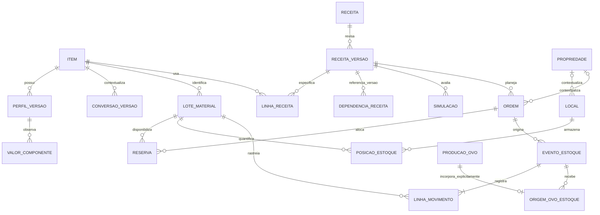
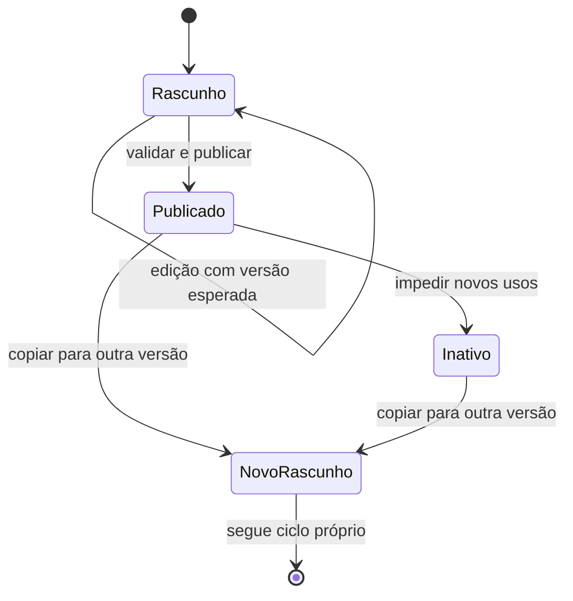
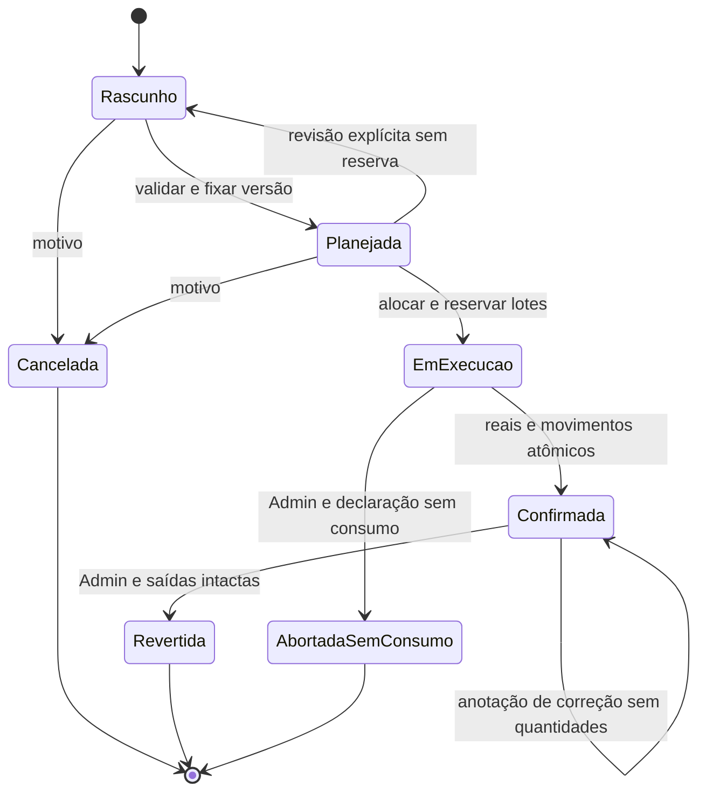

# Produção, Insumos, Produtos e formulação nutricional

Data: 2026-10-05. Evolução [#413](https://devops-lab.tailaf9418.ts.net/issues/413); Tarefa de planejamento [#415](https://devops-lab.tailaf9418.ts.net/issues/415). Documento para revisão humana. **Não autoriza implementação, migrations, publicação ou merge.**

Atualização de rastreabilidade em 06/10/2026: o usuário aprovou expressamente especificação/plano e autorizou somente MVP-1 P01–P05. A execução está na Tarefa #421 e verticais #422–#426, entregue para revisão. O diagnóstico abaixo registra o estado anterior à implementação. As decisões concretas compatíveis com o recorte (migration aditiva consolidada, documentos JSONB tipados, definições semânticas versionadas no código e serialização transacional das escritas) estão no [contrato operacional](../../operations/catalogo-formulacao.md). Fases físicas/custos, merge e produção continuam sem autorização.

Base investigada: `origin/main`, commit `37908e22d0ec5110dfd395bc91ac41d6e7a1df2f`, após atualização do remoto; contém o merge do PR #18 de Propriedades. Branch documental: `codex/415-planejamento-producao`.

Este documento define o domínio e as regras. O [plano de implementação](../plans/2026-10-05-producao-insumos-produtos-413-implementation.md) organiza as verticais, testes e gates; o [prompt futuro](../plans/2026-10-05-producao-insumos-produtos-413-prompt.md) depende do aceite deste conjunto.

## 1. Diagnóstico e evidências

O diagnóstico anterior permanece válido: há produção individual de ovos; não há catálogo operacional de itens, estoque, receitas, formulação ou ordens de transformação. Não existe saldo que possa ser utilizado como disponibilidade. A categoria financeira “Insumos” não é um catálogo nem comprova aquisição física de materiais.

Referências abaixo são relativas à raiz do repositório e à base registrada, não a implementações futuras:

| Evidência inspecionada | Constatação e consequência |
| --- | --- |
| `README.md`, “Roadmap macro”; `docs/architecture/overview.md`, “Módulos previstos” e “Camadas” | .NET 8, Domain/Application/Infrastructure/API, EF Core/PostgreSQL; React/TypeScript. Roadmap não cria domínio automaticamente. Não foi encontrado roadmap separado; estes textos e o menu são as referências atuais. |
| `src/Frontend/GenSW.Web/src/features/auth/navigation/modules.ts:55`, `:74`, `:78`, `:86` | Produtos é catálogo planejado de produtos/insumos; Produção tem descrição agrícola; Produção animal e Estoque são planejados. Não promover módulos sem rotas reais. |
| `src/Frontend/GenSW.Web/src/routes/AppRoutes.tsx:44`, `:68`, `:85` | Sessão protege telas; ovos têm consulta individual em Animal. Não há rota de transformação nem estoque. |
| `src/Backend/GenSW.Infrastructure/Persistence/GenSWDbContext.cs:38`, `:279` e inventário de Domain/Controllers/migrations | `ProducoesOvos` existe; não há entidades/DbSets/endpoints de itens, receitas, lotes de material ou estoque. `Prole` é origem reprodutiva, não lote de estoque. |
| `src/Backend/GenSW.Domain/Animals/ProducaoOvo.cs:3`; `src/Backend/GenSW.Application/Animals/ProducaoOvos/ProducaoOvoService.cs:3`; `src/Backend/GenSW.Infrastructure/Animals/ProducaoOvos/ProducaoOvoRepository.cs:7` | Registro tem Animal, postura, peso em gramas e observação; não tem quantidade coletiva nem destino/saldo. Serviço aceita fêmea de espécie ovípara. Registro é editável, sem movimento físico. Peso padrão da Espécie serve às métricas, não a conversão de estoque. |
| `src/Backend/GenSW.API/Controllers/ProducoesOvosController.cs:7` | POST/GET/PUT autenticados sob `/api/v1/animais/{animalId}/producoes-ovos`; contrato atual será preservado. |
| `src/Backend/GenSW.API/Controllers/PropriedadesController.cs:8`; `src/Backend/GenSW.Application/Properties/PropriedadeService.cs`; `src/Backend/GenSW.Infrastructure/Properties/PropriedadeRepository.cs` | Catálogo com criação/consulta/edição/status, busca, página padrão 25/máximo 100, ordenação permitida, desempate por Id e escaping de busca. Reutilizar o padrão, sem acoplar o novo domínio à exceção `AnimalEvolutionException`. |
| `src/Frontend/GenSW.Web/src/features/properties/PropertiesListPage.tsx`, `src/Frontend/GenSW.Web/src/features/properties/PropertyDetailsPage.tsx`; `src/Frontend/GenSW.Web/src/shared/details/DetailsPage.tsx`, `src/Frontend/GenSW.Web/src/shared/details/useRecordDetails.ts`, `src/Frontend/GenSW.Web/src/shared/details/listNavigation.ts` | Visualizar separado de Editar; estados de carregamento/erro; retorno preserva filtros/página. Novos seletores precisam busca e paginação no servidor, sem carregar todo o catálogo. |
| `src/Backend/GenSW.Infrastructure/Animals/AnimalMutationScope.cs:14`; `src/Backend/GenSW.Infrastructure/Properties/PropriedadeRepository.cs` | Transação, `FOR UPDATE`, timeout e índices parciais protegem invariantes. Inspiração para operações físicas, não reutilização de locks genealógicos. |
| `src/Backend/GenSW.Infrastructure/Financial/FinancialRepository.cs:21`, `:46`; `src/Backend/GenSW.Domain/Financial/Caixa.cs`; `src/Backend/GenSW.API/Controllers/FinanceiroController.cs:9` | Há lock transacional do módulo, versão esperada, idempotência persistida, auditoria com autor, valores anteriores/novos e autorização Admin pontual. Adotar mecanismo semelhante com tabelas/lock próprios; não alterar Caixa. |
| `tests/GenSW.API.Tests/PostgreSqlPropriedadesTests.cs`; `tests/GenSW.Infrastructure.Tests/FinancialTests.cs:56`, `:133`; `tests/GenSW.Infrastructure.Tests/AnimalEvolutionTests.cs` | Testes reais de concorrência, rollback e migrations são padrões úteis. Inspeção não equivale a execução dos testes nem certifica cobertura atual de ovos. |
| `.github/workflows/ci.yml`; `src/Frontend/GenSW.Web/package.json` | CI Backend executa restore/build Release/test com PostgreSQL efêmero; Frontend executa npm ci/test/lint/build. Gates futuros precisam ambos e navegador. |

Demandas Redmine conferidas via API autenticada, projeto 23: #413/#414 (proposta e preparação do prompt), #404/#412 (Propriedades e merge aceito), #386 (navegação), #376 (Caixa), #359 (Ciclos/Proles) e #291 (núcleo Animal). A consulta paginada de todas as demandas não encontrou outra Evolução específica de catálogo/estoque/transformação além da #413. Estados de demandas antigas podem ainda conter pendências de aceite; disponibilidade foi comprovada pelo código, não inferida do status Redmine. A associação no projeto usa o papel dedicado `Codex`; nenhum papel foi alterado.

## 2. Escopo e decisões para revisão

Objetivo: transformar materiais em intermediários/produtos, formular e comparar misturas com dados rastreáveis e executar produção com consumo/saídas atômicos. Destino interno, venda potencial ou ambos não mudam a identidade do item.

Três cenários obrigatórios:

1. Grão → ingrediente moído → mistura posterior. Grão e moído são itens distintos porque o estado/processo muda; o moído produzido e o moído usado depois são o **mesmo ItemId**, em lotes diferentes.
2. Mistura de ingredientes → ração para uso interno. Comparação calculada, metas explícitas e completude por nutriente; nenhuma declaração de dieta completa.
3. Ovos + ingredientes + embalagens → conserva potencialmente vendável. Quantidades reais, líquido/drenado/bruto e lotes registrados; fórmula não valida processo, segurança ou validade.

| Decisão | Recomendação | Situação |
| --- | --- | --- |
| D01 — Identidade | Catálogo único `Item`, com capacidades de uso cumulativas; insumo/produto são papéis operacionais. | Recomendada; aguarda aceite do conjunto. |
| D02 — Entrega | Primeiro somente catálogo, receitas e simulações. Estoque mínimo e execução exigirão autorização posterior. | **Decisão informada pelo usuário em 2026-10-05.** |
| D03 — Ovos | Adiar vínculo; futura vertical de estoque começa por entradas manuais. Ponte individual fica como alternativa posterior. | **Decisão informada pelo usuário em 2026-10-05.** |
| D04 — Custos | Adiar custos. Quantidades e rastreabilidade são prioritárias; preços, rateio e custo por lote não integram o primeiro MVP. | **Decisão informada pelo usuário em 2026-10-05.** |
| D05 — Execução | Reservar lotes explicitamente ao iniciar; confirmar reais em uma única transação. Sem WIP contábil ou consumo parcial contabilizado antes da confirmação. | Proposta de fase futura; revalidar antes da execução física. |
| D06 — Permissões | Autenticados consultam, cadastram, formulam, planejam, iniciam e confirmam; Admin faz entradas iniciais, ajustes, bloqueio/liberação de lotes e reversões. | Recomendada, coerente com Identity existente. Controle por Propriedade fica fora. |
| D07 — Nutrição | Formulação manual assistida no MVP; sem solver, requisitos por espécie ou tabela nutricional automática. | Recomendada. Metas reais e fontes serão informadas caso a caso. |
| D08 — Histórico | Versões publicadas imutáveis e snapshots de simulação/execução; revisão explícita nunca recalcula história silenciosamente. | Recomendada. |

Somente investigação e documentação estão autorizadas. D02–D04 resolvem o recorte de negócio, mas não autorizam implementação. Demais escolhas não se tornam aprovadas pelo silêncio. A revisão pode aceitar o conjunto ou registrar alterações. Não criar antecipadamente todas as Tarefas de execução. Se o vínculo individual de ovos não representar a coleta real (registro usado como amostra, por exemplo), manter entrada coletiva manual identificada até definir uma origem coletiva própria.

**Recorte decidido:** MVP-1 = catálogo, unidades/conversões explícitas, perfis, receitas versionadas, simulações/comparação manual e rastreabilidade das fontes/versões. Não terá tabelas/telas/endpoints de lotes operacionais, locais, saldo, reserva, ordem física, entrada de ovos, preços ou custos. Lote citado num laudo é identificação documental textual no MVP-1, não FK para uma entidade física antecipada. Os §§9–10 e agregados físicos do §4 são projeto de fases posteriores, não autorização para implementar dependências futuras.

Fora do MVP: compras/pedidos, vendas efetivas, fiscal, contabilidade, rotulagem regulatória, necessidade nutricional automática, otimização avançada, protocolo completo de segurança alimentar, integração com balanças/laudos externos, WIP contínuo, múltiplas empresas e fronteiras de autorização por depósito/Propriedade. Não serão criadas entidades vazias para esses módulos.

## 3. Glossário e alternativas

| Termo | Significado |
| --- | --- |
| Item | Identidade estável do material, incluindo alimento, ingrediente, embalagem ou consumível. |
| Capacidade de uso | Pode entrar em produção, pode ser produzido, pode ter consumo interno, pode ser destinado à venda. Flags cumulativas não substituem validade técnica do uso. |
| Papel na receita | Ingrediente alimentar incorporado, outro material incorporado, embalagem ou consumível de processo. Define denominador/comportamento na fórmula, não um cadastro diferente. |
| Lote | Parcela rastreável de um item com origem, datas, perfil aplicável e situação de uso. Diferente de Prole/lote reprodutivo. |
| Local de armazenamento | Posição física onde um lote tem saldo; cadastro separado de Propriedade. |
| Destinação | Uso interno/venda potencial/misto informado na saída; disponibilidade física não comprova venda. |
| Receita/fórmula | Especificação versionada das entradas, saídas esperadas, etapas e rendimento. “Fórmula” é receita de mistura com cálculo nutricional compatível. |
| Simulação | Avaliação congelada de uma versão/variação, perfis, conversões e metas; sem reserva ou movimento. |
| Ordem | Planejamento de uma execução concreta, com responsável, contexto, lote alvo e apontamento real. |
| Movimento | Evento imutável de entrada, saída, consumo, produção, transferência ou compensação. |
| Perfil nutricional | Conjunto versionado de observações com proveniência e contexto; não tabela universal de adequação. |
| Base natural (BN) | Composição referida à massa do material com sua umidade. |
| Matéria seca (MS) | Massa excluindo umidade conforme medição/método do perfil. |
| Coproduto/subproduto | Outra saída aproveitável; “principal” é classificação da receita, não obriga valor econômico. |
| Perda | Material não aproveitado, segregado da saída em estoque; massa e causa quando conhecidas. |

**Catálogo único versus separado.** Separar Insumo e Produto duplicaria moído, ração vendida e ração consumida, exigiria reconciliação e permitiria perfis divergentes para o mesmo material. Catálogo único com múltiplas capacidades atende os cenários sem taxonomia rígida. Não usar uma entidade genérica que absorva Animal, Pessoa ou Propriedade: o agregado é específico de materiais.

**Estoque mínimo versus adiar execução.** Não há saldos existentes. O usuário decidiu adiar execução: MVP-1 não exibe disponibilidade física nem ordens. Quando uma fase física for autorizada, pequena vertical real de locais, lotes, entradas e movimentos precede confirmação. Nunca exibir saldo inventado nem “confirmar produção” apenas salvando um formulário.

**Manual versus otimização.** Manual assistida dá comparação, contribuições, metas e problemas explicáveis com poucos dados; solver exigiria coeficientes/custos/limites completos, modelo de viabilidade e validação adicional. Otimização linear sob restrições/custo é fase posterior; não selecionar biblioteca nesta etapa.

## 4. Agregados e relações propostas

Manter novas features verticais `Catalog` e `Formulation` no MVP-1; `Inventory` e execução em `Production` somente em fases físicas autorizadas. Nomes concretos podem seguir convenções da implementação. Domain define valores/regras; Application coordena casos de uso por interfaces específicas; Infrastructure fornece EF/Core e transações; API compõe serviços e valida autenticação. Não extrair framework universal de auditoria/versões somente por semelhança. A tabela e o diagrama representam o horizonte completo: MVP-1 termina em Simulacao; o restante não será pré-criado.

| Raiz / dependentes | Conteúdo e fronteira |
| --- | --- |
| Item | Guid, código, nome, descrição, categoria, capacidades, classe material, unidade canônica, ativo, versão e auditoria de alterações. Categorias são catálogo pequeno independente (nome, ativo). |
| ConversaoItemVersao | Conversão contextual imutável publicada: item, lote opcional, origem/destino, fator, método/fonte/data, autor; embalagem/conteúdo e densidade explícitos. Não pertence a uma conversão global entre dimensões. |
| PerfilNutricionalVersao / ValorComponente | Item, lote opcional, número da versão, estado, fonte e contexto; valores heterogêneos com base/unidade/método/proveniência próprios. Um valor referencia a umidade da mesma amostra usada na conversão. |
| Receita / ReceitaVersao / linhas | Cabeçalho estável; versão tem entradas, saídas, tamanho de referência, percentuais/quantidades, processamento, rendimento, etapas, observações e dependências fixadas. Edição de rascunho; publicação congela conteúdo. |
| Simulacao | Snapshot imutável de fórmula resolvida, composição, perfis, conversões, metas, motor de cálculo, resultados/completude; comparação referencia SimulacaoIds. Não movimenta inventário. |
| LocalArmazenamento | Guid, nome normalizado, descrição, PropriedadeId opcional, ativo e versão; inativação impede novas entradas/reservas mas não elimina saldo. |
| LoteMaterial | ItemId, código interno único, código externo opcional, fabricação/coleta, validade declarada opcional e fonte, origem, perfil selecionado, uso Liberado/Bloqueado/Encerrado, auditoria. Não carrega saldo global em campo editável. |
| PosicaoEstoque / Reserva | Chave única (LoteId, LocalId), quantidade canônica atual e reservada como projeção transacional; reserva pertence a uma Ordem e nunca excede saldo. Livro de movimentos reconcilia projeção. |
| EventoEstoque / linhas | Autor, UTC, data operacional, motivo, origem, correlação/idempotência; linhas referenciam lote/local/quantidade/custo snapshot. Movimentos append-only; transferência grava débito e crédito juntos. |
| OrdemProducao / execução | Versão, estado, ReceitaVersaoId, snapshot planejado, PropriedadeId opcional, responsáveis/datas, reservas; confirmação imutável tem consumos, lotes de saída, perdas, reais, custos e parâmetros. |
| OrigemOvoEstoque | Ponte opcional: ProducaoOvoId único, evento de entrada, snapshot animal/postura/peso/data da leitura; sem propriedade de Animal ou alteração da postura. |
| Auditoria e idempotência do domínio | Histórias próprias com autor/operação/motivo/antes/depois, IDs e respostas mínimas; sem secrets. Armazenamento na mesma transação do evento. |



O diagrama representa referências, não cascatas de exclusão. Uma execução conecta **todas** as linhas de consumo às saídas; a genealogia de materiais é conservadora por lote (não inventa qual átomo foi para cada coproduto). Explorar origens e destinos por paginação e expansão limitada, sugerida profundidade inicial 2/máxima 10, sem percurso ilimitado. Arestas por eventos reais tornam A → B → C rastreável mesmo se B também for entrada em outra receita. Operações não consomem lotes que elas próprias ainda vão criar.

## 5. Cadastro, unidades, precisão e histórico

Item: código obrigatório único case-insensitive (1–50, trim, sem significado de espécie/propriedade), nome 1–200, observação até 2000, categoria opcional, ativo, capacidades e classe `Alimentar`, `OutroMaterialIncorporado`, `Embalagem`, `Consumivel`. Código manual no MVP; não copiar sequenciador de Animal sem necessidade. Nome não precisa ser único: diferentes estados/processos podem ter nomes próximos. Alterar a identidade material (grão versus moído) cria outro item; mudar nome/categoria preserva Id e gera auditoria.

Inativação bloqueia novas linhas/publicações/reservas/consumos e saídas novas. História e saldo continuam consultáveis; permitir retirada por ajuste justificado/Admin, transferência para segregação e reversão compensatória. Perfil/receita inativos continuam reproduzindo simulações e execuções antigas. Unidade canônica é imutável após primeiro uso em versão publicada ou estoque; corrigir erro exige novo item e tratamento explícito dos saldos, não reconversão retroativa.

| Grandeza | Canônica | Conversão permitida |
| --- | --- | --- |
| Massa | kg | g ↔ kg por fator exato; mg apenas em composição. |
| Volume | L | mL ↔ L por fator exato. |
| Contagem | un | Inteiro positivo em entradas/saídas; frações de ovo/frascos não entram como unidade física. |
| Embalagem de fornecimento | Não é dimensão universal | “saco de 25 kg” referencia item + conteúdo/fator versionado; frasco vazio é item contado; frasco cheio pode ser outro item contado, com pesos medidos do lote. |

Não converter L em kg sem densidade com contexto/método/data (incluindo condição relevante). Não converter un em kg sem massa por unidade aplicável ao lote. Média/peso padrão de ovo da Espécie nunca substitui pesagem do lote. No MVP, conversões contextuais são pares diretos, sem inferência de caminhos ou densidade recíproca entre materiais. Fator deve ser positivo; direção inversa pode usar seu recíproco preservando a mesma versão e a precisão. Massa por unidade e densidade são estimativas/declaradas/medidas conforme fonte, exibidas como tal.

Quantidades/custo unitário/perfil: `decimal(20,6)`; percentuais/coeficientes até 6 casas e limites de faixa; total de custo monetário `decimal(18,2)` BRL, sem significado de despesa de caixa. Operações usam `decimal` com overflow verificado; armazenar observação original e valor normalizado. Rejeitar excesso de casas de entrada e resultados fora dos limites. Cálculo mantém precisão de decimal antes da quantização; escala de estoque arredondada a 6 casas com `MidpointRounding.ToEven`, explicitando diferença/resíduo e pedindo confirmação quando altera o apontamento. Contagens devem ser inteiras; escalonamento que exigir fração mostra incompatibilidade e exige ajuste explícito, sem `ceil` escondido. Resultado nutricional pode mostrar 2/3 casas, mas metas comparam valor interno antes do arredondamento.

Novos contratos de valores decimais usam strings invariantes (ex.: `"12.500000"`), validadas no servidor; frontend formata pt-BR e não calcula saldos com `Number`. Essa escolha local evita perda de precisão; não muda contratos financeiros/ovos existentes. Contagens inteiras e números de versão podem ser números JSON dentro dos limites de inteiro seguro.

Para conserva: bruto = conteúdo + embalagem; líquido = conteúdo sem embalagem; drenado = parte após drenagem conforme método **informado**, não inferido. Armazenar lote/medição, amostra/tamanho, média ou total, unidade, método, data/autor. Quando medidos na mesma abrangência: 0 ≤ drenado ≤ líquido ≤ bruto. Ausência permanece desconhecida. `un` do frasco cheio é unidade de estoque; massa líquida/drenada identifica a base de cálculo, não constitui dois saldos alternativos editáveis.

## 6. Perfis nutricionais e fontes

Perfil: Rascunho → Publicado → Inativo. Publicação exige ItemId, identificação da fonte/laudo (URL ou identificador textual), datas de fonte/coleta quando conhecidas, método, preparação/parte analisada, referência de lote/amostra, base e unidade por observação. Data de publicação é diferente de data de análise. Fonte desconhecida não gera valor “medido”; registros incompletos podem ficar em rascunho. O MVP registra referência textual/URL; upload de laudo não é dependência.

Separar duas dimensões: **estado** `Conhecido` (inclui zero explícito), `Desconhecido`, `NaoAplicavel`; e **origem** `Medido`, `Declarado`, `Estimado`. Conhecido exige número ≥ 0 e origem/fonte; desconhecido/não aplicável exige valor null e motivo, nunca zero artificial. Estimado registra equação/hipóteses/perfis de origem e versão do motor. Abaixo do limite de detecção não é zero: preservar qualificador/limite no registro da fonte; MVP trata como desconhecido para metas, sem substituição automática por metade do limite. Faixas/intervalos de incerteza podem ser registrados como contexto, sem otimização intervalar no MVP.

Valor por componente: código semântico, valor/unidade/base, método, fonte específica opcional herdada do perfil, origem, qualificador e contexto. Isso evita tratar cinzas como “minerais totais disponíveis”, proteína declarada humana como PB calculada ou qualquer campo “fibra” como equivalente. Tabela pequena de definições versionadas, não editor livre de equações. Garantia mínima/máxima de fabricante não é valor pontual medido: preservar qualificador `Minimo`/`Maximo`/`Faixa`; no MVP-1, cálculo escalar usa somente valor pontual conhecido ou estimativa explicitamente escolhida e documentada. Dado apenas limitado fica indeterminado para esse cálculo; análise de intervalos fica posterior, sem usar um mínimo como teor exato.

| Prioridade | Componentes | Semântica proposta |
| --- | --- | --- |
| P0 | Umidade / matéria seca | Frações complementares na BN para a mesma amostra/método. Guardar medido e derivado identificado; se ambos declarados divergirem além da resolução da fonte, exigir correção, sem normalização automática. MS > 0 para dividir. |
| P0 | Proteína bruta | PB com método/fator de nitrogênio quando usado; não “proteína verdadeira/digestível”. Fonte que só diz “proteína” não autoriza renomear PB. |
| P0 | Gordura / extrato etéreo | Códigos distintos quando método/fração diferirem; lipídio declarado não ganha equivalência automática ao extrato etéreo. |
| P0 | Fibra bruta | Fração pelo método analítico informado, apta a comparação somente com chave compatível. |
| P0 | Energia informada | EB, ED, EM, EM corrigida por nitrogênio (EMAn etc.) ou energia líquida com finalidade/contexto explícitos. Só disponibilizar o que a fonte define. |
| P1 | Cinzas; amido; carboidratos por diferença | Cinzas como resíduo do método; amido analisado separado; carboidratos por diferença apenas equação/componentes completos e sem sobreposição. Não deduzir amido de “carboidrato”. |
| P1 | FDN, FDA, lignina | Frações por métodos específicos; registrar tratamento com amilase, correção de cinzas/proteína quando aplicável. Não converter em fibra bruta/alimentar nem somar frações sobrepostas. |
| P1 | Ca, P total, Na; lisina e metionina | Massa por kg com método/base; mineral total não é disponível/digestível; aminoácido total não é digestível. Priorizar quando metas reais forem definidas. |
| Posterior / sob demanda | P disponível/digestível, aminoácidos digestíveis, metionina+cistina, treonina, triptofano, K/Mg/microminerais, vitaminas, fibra alimentar total/solúvel/insolúvel | Novo código só com semântica, método, contexto e fonte. Não criar dezenas de campos vazios ou requisitos de espécies nesta etapa. |

Modelo suporta P1, mas MVP implementa cálculo dos códigos utilizados com definição explícita; não entrega um “laudo completo” por possuir campos. Embalagens e consumíveis não exigem perfil. Outro material incorporado pode ter massa no conteúdo e valores desconhecidos/não aplicáveis conforme componente; se faz parte da massa comestível da mistura, não pode ser excluído do denominador só porque faltam nutrientes. Água incorporada conta na massa/umidade se declarada; seus componentes não são presumidos zero.

Bases suportadas inicialmente: BN por kg/100 g de material identificado; MS por kg/100 g de MS. Fonte por porção ou % de proteína fica preservada, mas exige conversão explícita para uma base suportada com denominadores conhecidos. “Parte comestível” ou “parte drenada” é atributo do material/amostra, não sinônimo de BN: perfis da conserva drenada não descrevem automaticamente líquido total do frasco.

Aplicabilidade: espécie (EspecieId opcional), fase de uso textual, estado/processo do item e lote/amostra. Energia utilizável e digestibilidade exigem contexto compatível; ausência de espécie não significa universalidade. Ao selecionar perfis, versão exata é explícita: preferir candidato do lote, oferecer candidato genérico compatível com aviso, **sem fallback silencioso**. Mais de um candidato exige escolha; guardar em simulação. Perfil genérico tem variabilidade e não é laudo de cada lote. Selecionar outro perfil depois não muda resultado antigo.

Fontes primárias consultadas em 2026-10-05, utilizadas para conceitos e proveniência, não para semear nutrientes ou metas:

- [FAO — What is food composed of?](https://www.fao.org/4/S4314E/s4314e04.htm), especialmente §§3.1.5 e 3.2: diferencia bases e modalidades energéticas. Manual voltado a peixes/crustáceos; seus coeficientes e necessidades não serão transferidos a aves/codornas. Fundamenta a exigência de base e contexto, não uma tabela pronta.
- [FAO — Assessing quality and safety of animal feeds, Sources of data](https://www.fao.org/4/y5159e/y5159e04.htm): origem, processamento e condições influenciam a interpretação dos dados. O desenho conserva essas informações e evita média automática entre processos distintos.
- [USDA — Foundation Foods Documentation](https://fdc.nal.usda.gov/Foundation_Foods_Documentation/): documentação de amostras, datas, métodos e variabilidade, em contexto alimentar humano. Serve de referência de proveniência; energia humana importada não será reclassificada como EM de ração.
- [FAO — Dietary Fibre and Resistant Starch Analysis](https://www.fao.org/4/w8079e/w8079e0i.htm): métodos recuperam frações diferentes; justifica códigos separados para fibra bruta, alimentar e detergente. Texto conceitual histórico; não impõe método atual de laudo.
- [FAO — Quality assurance for animal feed analysis laboratories](https://www.fao.org/4/i2441e/i2441e00.htm): referência complementar de qualidade/métodos; validar método e amostragem antes de usar um laudo real.
- [NIST — SI Appendix B.8](https://www.nist.gov/pml/special-publication-811/nist-guide-si-appendix-b-conversion-factors/nist-guide-si-appendix-b8): adotando kcal termoquímica, 1 kcal = 4184 J = 0,004184 MJ. Outras convenções precisam identificação. Troca de unidade não troca modalidade energética.

Não foram consultadas tabelas específicas para prescrever dietas nem normas para declarar segurança de conserva; não há afirmações de adequação ou conformidade regulatória. Recomendações técnicas futuras exigem fonte primária pertinente à espécie/fase/processo, edição e revisão profissional registrada, distinguindo-as de metas livres do usuário.

## 7. Receitas, versões e sub-receitas

Receita estável: código único/nome, finalidade e ativo. Versão: número sequencial único por ReceitaId, estado Rascunho/Publicado/Inativo, tipo MisturaSimples/Processamento, lote de referência (grandeza e quantidade), linhas de entrada, saídas principal/coproduto, perdas esperadas, embalagem/consumíveis, etapas textuais/ordem, observações e parâmetros. Publicação é operação explícita com versão esperada. Alteração gera novo rascunho; nunca sobrescreve publicada.

Ciclo de vida de uma versão de receita/perfil no MVP-1:



`NovoRascunho` é outra identidade de versão; a anterior não retorna a editável. Simulação persistida é um snapshot imutável: nova avaliação produz outro registro e referência à anterior quando pertinente. Catálogo e receita como cabeçalho têm ativo/inativo separado do estado de cada versão.

Entradas em quantidades absolutas ou percentuais de massa BN da mistura alimentar; modo único para esse conjunto. Percentuais positivos devem totalizar exatamente 100 na precisão aceita; não normalizar 97 ou 103 sem decisão do usuário. Embalagens/consumíveis ficam em quantidades por lote/unidade de saída, fora dos 100%. Processamentos podem ter entradas em kg/L/un e saídas em outras dimensões com medição/conversão; não forçar percentual nutricional quando não existe denominador. `MisturaSimples` pressupõe saída alimentar única com massa igual à soma incorporada e ausência declarada de perdas/alteração de umidade/retenção; rendimento diferente, drenagem ou perda relevante exige `Processamento` e as regras do §8.3. A classificação não pode ativar conservação de nutrientes em um processo incompatível.

Escalonar pelo fator `tamanho solicitado / tamanho de referência` da mesma grandeza. Linhas variáveis escalam linearmente, com prévia de arredondamentos; fixas por lote devem ser marcadas e não entram na fórmula percentual. Toda linha declara quantidade/unidade e comportamento de escala. No MVP, não há funções arbitrárias de escala. Receita não estabelece estoque disponível.

Sub-receita sempre referencia **versão publicada específica e saída escolhida**, com quantidade requerida dessa saída. Escala pela quantidade esperada da saída, incluindo rendimento; jamais soma ingredientes de toda a sub-receita duas vezes. Grafo de versões deve ser acíclico; publicação rejeita autorreferência direta/indireta e dependência transitiva da mesma ReceitaId (A v2 → B → A v1), preservando simplicidade operacional. Limites sugeridos: profundidade máxima 10 e 500 linhas expandidas; excedente retorna erro explicável, não trava a consulta.

Dois usos separados: (a) simular fabricar o intermediário, expandindo os insumos/hipóteses; (b) consumir intermediário já estocado, usando ItemId/lote/perfil próprio e **sem** consumir de novo o grão ancestral. Ordem executa uma etapa com entradas em estoque; sub-receitas anteriores exigem ordens separadas explicitamente confirmadas. Não disparar árvore de ordens automaticamente. Processamento da sub-receita sem perfil/retensão válida resulta em nutrição desconhecida, não expansão por conservação presumida.

Snapshot de simulação: versão da receita, linhas resolvidas, conversões/perfis usados, dados originais e normalizados, espécie/fase/metas, hipóteses, tamanho, resultados e versão do algoritmo. Snapshot de ordem planejada fixa a receita e os parâmetros; confirmação fixa lotes reais, perfis/conversões reais, quantidades e cálculo realizado. Divergência planejado/real aparece lado a lado. Novo cálculo solicitado gera outra SimulacaoId; histórico não é “refresh” pela versão atual do catálogo.

## 8. Cálculos verificáveis e comparação

Motor do backend é autoridade; frontend exibe contribuições e motivos de impossibilidade. Exemplos abaixo são **sintéticos**, com ingredientes A/B fictícios e hipóteses declaradas. Não são recomendações de alimentação.

### 8.1 Normalização e mistura simples

Para componente N, `m_i` em kg BN e `c_i` em g/kg BN: contribuição `q_i = m_i × c_i` em g; `M = Σ m_i`; `Q = Σ q_i`; `C_BN = Q/M` em g/kg; por 100 g = `C_BN/10`; percentual massa = `C_BN/10`. Não somar percentuais de ingredientes sem ponderar massa. Com energia compatível em MJ/kg, a mesma soma produz MJ e MJ/kg.

Com umidade `u_i` como fração BN e `d_i = 1-u_i`: `MS_i = m_i × d_i`; concentração `c_BN = c_MS × d_i`, `c_MS = c_BN/d_i`. Para mistura: `MS_total = Σ MS_i`, `u_mistura = 1 - MS_total/M`, `C_MS = Q/MS_total`. Somar concentrações MS ponderadas pela massa BN é errado. Conversão exige umidade conhecida da amostra/contexto; não usar “umidade típica” oculta. u entre 0 e 1; u=1 não permite dividir; concentração em massa não pode ultrapassar 1000 g/kg de sua base.

| Perfil fictício, mesma modalidade/contexto energético | A | B |
| --- | ---: | ---: |
| PB, g/kg BN | 100 | 400 |
| Fibra bruta, g/kg BN, método compatível | 20 | 80 |
| Energia, MJ/kg BN, modalidade comum explicitamente selecionada | 12 | 8 |
| Umidade BN | 10% | 20% |

F1 = 60 kg A + 40 kg B, sem processamento/perdas, saída 100 kg:

- PB: 6000 + 16000 = 22000 g; **220 g/kg = 22 g/100 g = 22% BN**.
- Fibra bruta: 1200 + 3200 = 4400 g; **44 g/kg = 4,4 g/100 g**.
- Energia: 720 + 320 = 1040 MJ; **10,4 MJ/kg**, equivalentes a aproximadamente **2485,6597 kcal/kg** na mesma modalidade.
- MS: 54 + 32 = 86 kg; umidade 14%; PB = **255,813953 g/kg MS**, fibra = **51,162791 g/kg MS**, energia = **12,093023 MJ/kg MS**.
- Exemplo individual: A tem 100/0,9 = 111,111111 g/kg MS de PB; multiplicar por 0,9 recupera 100 g/kg BN.

F2 = 30 kg A + 70 kg B: PB 310 g/kg BN; fibra 62 g/kg BN; energia 9,2 MJ/kg BN; MS 83 kg. Meta **sintética do usuário** PB ≥ 250 g/kg, energia ≥ 10 MJ/kg, fibra ≤ 50 g/kg, todas BN: F1 atende energia/fibra e falha PB; F2 atende PB e falha energia/fibra. Nenhuma atende o conjunto. “Mais proteína” não significa melhor dieta.

### 8.2 Dados faltantes e metas impossíveis

Se PB de B for desconhecida, F1 tem contribuição conhecida 6000 g e cobertura de massa 60%. Exibir: “contribuição conhecida 60 g/kg do lote; total indeterminado; falta PB de B, 40 kg”. Isso **não é** PB total de 6%, nem média dos ingredientes conhecidos, nem autorização para meta atingida. Denominador M permanece 100 kg; se massa de uma linha alimentar também for desconhecida, cobertura percentual é indeterminada e mostra linhas/massa conhecida. Com MS desconhecida de B, resultado MS e metas MS ficam indeterminados, ainda que PB BN seja calculável.

Completude é por componente/contexto: `massa BN das linhas com dado compatível / massa BN alimentar total`, exibindo origem medida/declarada/estimada separadamente. NãoAplicavel em embalagem não participa; em linha alimentar precisa justificativa e não constitui contribuição zero. Estado do resultado: Completo, Parcial ou Indeterminado; confiança/proveniência é separada. Completo com estimativas significa **completo estimado**, não medido. Meta retorna AtendidaNosDadosDisponiveis, NaoAtendida ou Indeterminada; política pode excluir valores estimados e assim tornar meta indeterminada. Mostrar evidência e hipótese mesmo quando atendida.

Detectar min > max imediatamente. Para mistura simples apenas A/B, PB mínima de 450 g/kg é impossível porque máximo entre dados completos é 400 g/kg. Limite de B ≤ 20% reduz máximo PB a 160 g/kg. São verificações locais verificáveis, não solver de todas as metas; quando não houver prova de impossibilidade, dizer “esta formulação não atende”, sem alegar inexistência de solução. Ingrediente indisponível não invalida a matemática da simulação, mas impede afirmar executabilidade.

Meta: componente/modalidade, mínimo/máximo/faixa, base, unidade, espécie/fase, tamanho de lote, origem `InformadaUsuario` ou `ReferenciaTecnica`, fonte/contexto quando técnica, e política de aceitar estimados. Limites de inclusão são específicos à receita/objetivo, em % da massa alimentar BN no MVP; não inventar limites por espécie. Comparação exige mesma base/componente/modalidade/contexto; mostrar lado a lado com “não comparável” quando não puder converter. Nutrientes ausentes não impedem todos os outros cálculos, mas impedem validar o objetivo que deles depende.

### 8.3 Processamento, rendimento e drenagem

`rendimento = massa da saída escolhida / massa das entradas materiais do escopo declarado`, somente quando ambas podem ser convertidas para massa. Excluir embalagem do rendimento alimentar, mas mantê-la em custo/consumo. Declarar se água/outros incorporados entram no denominador. Quando houver kg/L/un sem conversões, mostrar quantidades por dimensão e rendimento não calculável; não somar grandezas.

Exemplo sintético de secagem: entrada 100 kg com 20 kg de água e 10 kg de PB; saída medida 90 kg; hipótese explícita de perda exclusivamente de 10 kg de água e PB retida integralmente. PB estimada = 10/90 = 11,111111% BN; MS 80 kg → PB 12,5% MS. Se retenção **validada para o cenário hipotético** for 90%, PB de saída = 9 kg e 10% BN; destino de 1 kg precisa constar nos parâmetros/perdas. Sem hipótese/medição, não calcular PB final por simples divisão da PB de entrada.

MVP processado aceita perfil medido/declarado do resultado ou estimativa explicitamente selecionada com parâmetros por componente e escopo. Retenção r entre 0 e 1 indica quantidade conservada daquela contribuição; incorporações entram separadas, com perfis/massas próprios. Fórmula geral estimativa: `Q_saida,j = Σ(Q_entrada,i,j × r_i,j)` para uma saída/escopo definido; concentração divide pela massa medida/estimada da mesma saída. Coprodutos requerem distribuição por componente/saída, soma de frações ≤ 1; sem isso, não calcular nutrição de cada coproduto. Implementação de modelos multissaída de retenção avançados fica posterior; MVP conserva parâmetros como referência e usa perfil de saída explícito.

Moagem: 100 kg de grão → 98 kg de moído + 2 kg de perda; não atribuir perfil integral do grão ao moído automaticamente. Pode escolher estimativa documentada “sem alteração composicional relevante, perda proporcional” ou perfil específico; evidenciar origem estimada.

Conserva hipotética: 10 frascos de item final contado; pesagem total bruto 5 kg, líquido 4 kg, drenado 2,5 kg, tara 1 kg. Massa líquida por frasco 0,4 kg é relação desse lote/medição, não de todos os frascos. Nutrição drenada exige perfil da fração drenada; não multiplicar todos os nutrientes das entradas por 2,5/4. Salmoura absorvida, cascas descartadas, evaporação e retenção precisam medidas/parâmetros. Valores não definem procedimento, validade ou segurança.

Balanço exibido como entradas materiais + incorporações − saídas − perdas = diferença não explicada, só para massas compatíveis e escopo comum. Não obrigar igualdade artificial; diferença exige observação na confirmação, com dados faltantes identificados. Não inventar perda “ajuste” para esconder conversão ausente.

## 9. Estoque mínimo e execução — fase posterior, fora do MVP-1

Desenho antecipado para preservar fronteiras. Não criar suas entidades, FKs, migrations, APIs ou telas no primeiro MVP. Antes da implementação física, revalidar este capítulo com o uso real e obter aceite específico. Começar por entradas manuais, conforme D03, sem ponte de ovos e sem custos conforme D04.

### 9.1 Estoque e disponibilidade

Começa vazio. Admin registra abertura por lote/local e quantidade real declarada; abertura não reconstrói compras nem registra despesa. Entradas manuais posteriores têm origem/motivo/autor, custo opcional e identificação de lote; usuários autenticados podem registrar recebimento operacional declarado, mantendo ajustes/abertura restritos a Admin. Nenhum backfill de caixa/animais para saldos. Locais são explícitos, um ou mais conforme cadastrados; Propriedade opcional não gera depósito automaticamente.

Validade é dado declarado/validado com fonte e responsável; não inferida da receita. Lote sem validade mostra “não informada”. Para classes configuradas no item como exigindo validade, nova entrada/produção sem data fica Bloqueada até registro explícito/Admin com evidência; para outras classes, ausência não equivale a vencido e é exibida. Vencido na data de operação (validade < data, válida até o dia declarado inclusive), bloqueado, encerrado, item/local inativo não admite nova reserva/consumo ordinário. Não há override ordinário para consumir vencido; retirada/descarte justificado não afirma segurança. Inativação de Item/Local não elimina saldo. Alterações de situação/validade são auditadas e sincronizadas com confirmação.

Saldo físico contabilizado = entradas − saídas do livro; reservado = reservas ativas; disponível = físico − reservado. Saldo negativo e reserva excessiva são proibidos no servidor e no banco. Ordens Planejadas não reservam; ao iniciar, usuário escolhe lotes/locais (sugestão por validade pode existir sem escolha automática). EmExecucao mantém reserva indisponível; não há nova contabilização até confirmação final. Durante o processo, o saldo mostrado é saldo contabilizado com parcela em execução reservada, não uma contagem física instantânea. Essa limitação exclui WIP em etapas longas/consumo contínuo do MVP.

Consumo interno e saída manual justificada registram movimento real, lote/local, finalidade e responsável, sem venda/caixa. Transferência entre locais é atomicamente débito/crédito e preserva origem. Disponível para venda é quantidade elegível **e não reservada** de lotes com destinação permitindo venda; consulta, não pedido/venda. “Vendável” representa intenção operacional, não autorização sanitária/regulatória. Vendas efetivas não serão simuladas; futuro módulo deverá consumir pelo mesmo caso de uso protegido.

Data operacional de movimentos = data de registro em America/Sao_Paulo pelo TimeProvider no MVP. Data observada/fabricação/coleta pode ser anterior e fica separada; não inserir débitos retroativos recalculando saldos históricos. Correções são eventos presentes vinculados ao original. Auditoria e ordem registram UTC e datas reais observadas; não alegar que o banco registrou a transformação exatamente quando ocorreu.

### 9.2 Estados, transições e responsabilidades



Rascunho editável exige versão esperada; Planejada contém snapshot/quantidades e validação de receita. Iniciar exige responsáveis/data, lotes e conversões aplicáveis, disponibilidade e versões. Ajustar reservas em execução é explícito/versionado, sem alterar snapshot planejado; verifica saldo novamente. Confirmar requer reais (consumo/saídas/perdas), datas coerentes (fim ≥ início, sem data real futura), responsáveis existentes, motivo de divergência quando aplicável. Autor autenticado pode diferir do responsável informado. Situação atual do item/lote/local é revalidada, não congelada como permissão eterna.

EmExecucao não volta a Planejada nem cancela como se nada tivesse ocorrido. Se nenhum material foi fisicamente consumido/transformado, Admin pode abortar com declaração explícita, auditoria e liberação de reservas; registrar estado `AbortadaSemConsumo` (transição adicional EmExecucao → AbortadaSemConsumo). Se houve consumo, confirmar reais/resultados, inclusive perda total justificada sem saída aproveitável, e liberar excesso reservado. Não exigir saída positiva em falha total; exigir destino das quantidades consumidas e motivo. Perda total excepcional requer Admin. Não registrar adiantamento de caixa.

Confirmada é imutável nas quantidades/receita/lotes. Correção descritiva é anotação append-only. Reversão integral excepcional descrita abaixo; novo registro correto referencia original. `DELETE` de ordem/evento confirmado não existe.

### 9.3 Atomicidade, concorrência e idempotência

A futura vertical física usa **um lock consultivo transacional próprio de Inventário/Produção**, separado de Caixa e Genealogia, em todas as mutações de saldo/reserva/situação de lote/status de Item/Local que interfiram no uso. Serialização global desse pequeno módulo é proporcional ao volume inicial; evitar um sistema genérico de filas/locks. Rascunhos/perfis/receitas usam versão esperada e unicidade própria. Publicação concorrente obtém lock de Receita; confirmação verifica estado corrente da versão e status sob locks de referência. Ordem: lock Inventário/Produção → Item/Local/Lote/Ordem em ordem estável de Id → referências somente leitura; não adquirir lock de Caixa ou Animal durante produção. A ponte de ovos lê snapshot sem chamar mutação Animal. Documentar timeout 5s e erro 409 transitório; leituras usam snapshot consistente para saldo/reservas/linha de produção.

Confirmar, na mesma transação:

1. Autenticar/autorizar; obter lock; buscar idempotência persistida por autor/operação/chave (inclui OrdemId).
2. Mesma chave/payload canônico retorna resposta original, inclusive após reversão; diferente payload → 409. A verificação de replay ocorre antes de rejeitar novo estado da ordem. Chave obrigatória até 100 caracteres; hash normaliza decimais/ordem das linhas conforme semântica. Índice único reforça exclusividade.
3. Validar versão esperada e estado; revalidar referências/situação/validade, conversões e saldo. Quantidades reais acima da reserva só aceitas se sobra não reservada estiver disponível; não retirar reserva de outra ordem.
4. Criar consumos reais, lotes e entradas de saídas, perdas, custo/snapshots, liberar reservas residuais, gravar auditoria e estado Confirmada + resposta de idempotência.
5. Commit único. Exceção/falta de saldo/timeout antes do commit desfaz todos os passos, inclusive projeções, lotes, custo, auditoria/idempotência. Erro não deixa ordem confirmada sem saída, nem saídas sem consumo.

Um índice único de confirmação por OrdemId impede segunda confirmação com outra chave. Duplo clique não é resolvido só por botão; UI preserva a chave em retries após timeout. Duas ordens disputando saldo: primeira transação reserva/consome; segunda recebe falta de saldo/409 sem saldo negativo. Não retry automático com payload alterado. Idempotência, origem de ovo e reversão têm unicidade no banco, além de validação em serviço. DDL/checks de não negativo e inteiros reforçam o modelo. Reconciliação do livro/projeção é leitura, sem reparo automático.

### 9.4 Reversão, correção e genealogia de materiais

Reverter Confirmada exige Admin, motivo, versão esperada, chave e ausência de **qualquer saída posterior, transferência, consumo, reserva ou venda futura** dos lotes gerados. Critério conservador: lotes gerados ainda estão integralmente na posição original, e não tiveram movimento de saída desde a confirmação; mesmo saldo recomposto depois não libera reversão. Bloqueado/inativo não impede compensação autorizada. Confirmar reversão debita saídas originais, credita entradas originais nos seus lotes/locais com situação atual preservada (se vencidos, retornam contabilizados mas indisponíveis), registra custos compensatórios e marca Revertida. Uma reversão por execução; operação inteira é atômica. Não “desapagar” movimentos.

Se saída já foi usada/vendida, bloquear reversão integral com referências dos eventos dependentes. No MVP, corrigir texto/anotar problema; correção quantitativa exige ajuste de estoque presente justificado/Admin, com evidência física, limitado ao saldo/reservas e sem restaurar insumos ancestrais. Ajuste fica ligado à execução mas não reescreve sua nutrição/custo histórico. Reprocessamento real usa nova ordem, consumindo lote disponível. Não existe cascade de desfazimento da cadeia. Futuras devoluções/vendas devem preservar essa regra, com nova revisão de domínio.

### 9.5 Aproveitamento de ovos sem duplicação

Conforme D03, **ponte adiada**, inclusive em relação ao primeiro estoque manual. Caso seja autorizada em fase própria, usuário escolhe registros explicitamente, item ovo e lote/local de recebimento; ponte preserva ProducaoOvoId e snapshot. Unidade preferida do ovo em estoque é `un`: um registro representa uma unidade somente após confirmação explícita dessa interpretação pelo operador; peso registrado é evidência de medição, não quantidade de lote. Entrada coletiva manual pode usar quantidade e peso total reais, sem forjar registros individuais.

Índice único ProducaoOvoId permite um único vínculo ao longo da vida, inclusive se evento for compensado. Evento pode agrupar vários registros e snapshot de cada um, sem entrada a cada edição. Leitura registra peso/postura e UpdatedAtUtc observados; edição concorrente/posterior do registro Animal não reconcilia estoque automaticamente. Consulta compara snapshot e atual e sinaliza diferença; o usuário corrige fisicamente por evento explícito. Ovos reprodutivos de Ciclos não viram unidades disponíveis por inferência. Não somar postura individual com entradas coletivas já existentes: UI pergunta se esses ovos foram recebidos antes e registra declaração de não duplicação; IDs previnem duplicidade da ponte, mas origem livre de entrada manual não permite garantia absoluta. Migrar acervo requer inventário físico declarado, não importação de todas as posturas.

## 10. Custos futuros e integrações preservadas

O usuário decidiu **adiar custos** (D04). A proposta abaixo é exclusivamente posterior: custo **estimado** usa preços de referência informados com fonte/data/unidade, sem saldo; custo **apurado de materiais consumidos** usa quantidade real × custo unitário congelado do lote/entrada. Não chamar este último “custo industrial completo”: sem mão de obra, overhead e compras conciliadas. Na futura fase de custos, lote recebe custo unitário na primeira entrada; entrada adicional com custo distinto gera outro lote interno (mesmo código externo possível) para evitar média silenciosa. Transferência preserva custo. Desconhecido não é zero; total conhecido parcial não autoriza lucro/margem. Nenhum preço/rateio/custo é requisito da simulação no MVP-1.

Uma saída: custo de materiais conhecido atribuído ao resultado, com tratamento de perda explicitado. Coprodutos: percentuais manuais por saída/destino de custo de perda totalizam 100%, motivo e autor obrigatórios; não ratear por peso unidades incompatíveis. Desconhecido fica parcial em todos os destinos. Valores monetários arredondados em centavos com maior resto e desempate por Id; soma deve reconciliar ao custo distribuído. Exemplo sintético: materiais R$ 100,00, saída X 70% e Y 30% → R$ 70,00/R$ 30,00. Custo unitário usa quantidade real da própria saída; perda total mantém custo como perda, sem dividir por zero. Rateio de rascunho é alterável; confirmação congela.

Produzir, receber estoque, consumir internamente, reservar ou declarar venda potencial **não cria** Receita/Despesa/LancamentoCaixa. Não chamar serviço Financeiro nem mudar categorias/status de Animal. Compras/vendas reais futuras poderão referenciar eventos por integração explícita e idempotente, a projetar depois. Pessoas podem ser referência opcional de origem/responsável quando necessário; responsável da execução é usuário existente, sem novo cadastro paralelo.

Propriedade contextualiza ordem/local, sem ser condição de produção ou limite jurídico/permissional. Animal/Filiação/Cruzamentos/Ciclos/Proles mantêm IDs, contratos e regras; produção nova não cria descendentes, ovos individuais ou filiações. Ponte de ovos é referência lateral, sem edição do histórico Animal. Caixa permanece realizado e independente de custos físicos.

## 11. Esboço de API e navegação

Rotas propostas sob `/api/v1`, todas autenticadas. **MVP-1 inclui somente Catálogo, Conversões/perfis, Receitas e Simulações** da tabela. Estoque/Produção física e exemplo de confirmação ficam futuros. Políticas Admin pontuais; ProblemDetails com code/identificadores seguros, 400 dados incompatíveis, 401 sessão, 403 papel, 404 ausente, 409 conflito/estado/saldo/idempotência. POST cria 201; comandos e leituras 200. Mensagens não revelam connection strings ou detalhes SQL. Paginação padrão 25/máximo 100, busca normalizada/escapada, filtros explícitos, campos de ordenação permitidos e Id como desempate. Sem endpoints de exclusão de fatos/versões publicadas.

| Grupo | Contratos propostos |
| --- | --- |
| Catálogo | GET/POST `/itens`; GET/PUT `/itens/{id}`; PATCH `/{id}/ativo`; GET `/{id}/historico`; GET/POST `/categorias-itens`. Edição/status usa versaoEsperada. |
| Conversões/perfis | GET/POST `/itens/{id}/conversoes` e `/perfis-nutricionais`; GET/PUT `/perfis-nutricionais/{id}` somente rascunho; POST `/{id}/publicacao`/`inativacao`; versão nova por POST, nunca PUT de publicada. |
| Receitas | GET/POST `/receitas`; GET `/receitas/{id}`; PATCH `/{id}/ativo`; GET/POST `/{id}/versoes`; GET/PUT `/receitas/versoes/{id}` rascunho; POST `/receitas/versoes/{id}/publicacao`/`inativacao`; prévia de dependências/ciclos/escalonamento. |
| Simulações | POST `/simulacoes-formulacao`; GET lista/`/{id}`; POST `/comparacoes-formulacao` com SimulacaoIds e contexto. Simulação/comparação persistida exige chave; resultados imutáveis. |
| Estoque | GET/POST `/estoque/locais`; GET/PUT `/{id}`, PATCH ativo; GET `/estoque/lotes`, `/{id}`, `/{id}/rastreabilidade`; POST bloqueio/liberação com evidência; GET `/estoque/saldos` e `/movimentos`; POST `/entradas`, `/consumos-internos`, `/saidas-manuais`, `/transferencias`, `/ajustes`; POST `/entradas-ovos` opcional. |
| Produção | GET/POST `/producao/ordens`; GET/PUT `/{id}` rascunho; POST `/{id}/planejamento`, `/revisao`, `/inicio`, `/reservas`, `/confirmacao`, `/cancelamento`, `/aborto-sem-consumo`, `/reversao`, `/anotacoes`; GET `/{id}/historico`. Estado nunca é PATCH arbitrário. |

Todos os comandos físicos, reservas e transições têm versaoEsperada/Idempotency-Key. Corpo mínimo de confirmação (esboço, nomes sujeitos ao contrato aprovado):

```json
{
  "versaoEsperada": 3,
  "dataFimObservada": "2026-10-05",
  "consumos": [{ "linhaId": "guid", "loteId": "guid", "localId": "guid", "quantidade": "60.000000", "unidade": "kg", "conversaoVersaoId": null }],
  "saidas": [{ "linhaId": "guid", "itemId": "guid", "quantidade": "58.000000", "unidade": "kg", "localId": "guid", "codigoLote": "LOTE-EXEMPLO", "destinacao": "UsoInterno", "validadeDeclarada": null }],
  "perdas": [{ "quantidade": "2.000000", "unidade": "kg", "motivo": "Perda medida no exemplo sintético" }],
  "motivoDivergencia": "Rendimento real apontado"
}
```

Resposta traz OrdemId, versão/estado, execução/eventos/lotes gerados e hashes/referências dos snapshots; preview de cálculo retorna lista de problemas, contribuição/completude e estado de cada meta. Nunca passa valor calculado pelo cliente como autoridade.

Navegação futura:

- Cadastros básicos: promover “Produtos” para **Insumos e produtos**, `/itens`, com filtros de capacidades/classe/categoria/status. Ações Criar, Visualizar, Editar, Inativar e consulta de perfis/conversões/histórico.
- Produção e operações: manter **Produção agrícola** planejada com descrição própria. Criar **Produção — transformações** com Receitas `/producao/receitas`, Comparar `/producao/formulacao`, Ordens `/producao/ordens`; cada destino promovido só quando vertical existir. Não tornar agricultura uma receita de mistura.
- Estoque: locais, lotes, saldos e movimentos com trilha de origem/destino e entradas/consumos explícitos. Propriedade é filtro/contexto opcional, não fronteira de acesso.
- Produção animal e Genética mantêm estado planejado e indicação dos ovos/genealogia disponíveis em Animal. Reprodução/Financeiro seguem seus destinos atuais.

Comparação no MVP-1: colunas de fórmulas, linhas de componentes compatíveis/metas; BN/MS claramente visível, unidade no valor, parcial/estimado em texto, contribuição expandida e fonte acessível. Formulário não exibe mensagem de “ração balanceada”. Não apresenta custos ou saldos. Disponibilidade pode ser consultada com timestamp na fase de estoque; não é congelada como reserva.

Ordem: planejado × real, lote/local por entrada, reservas, rendimento/perdas, saídas com destino, medição de conserva quando pertinente, responsável/datas; prévia antes da confirmação. Visualizar é leitura com ações de edição/comando em rotas específicas. Retorno mantém busca/página. Seletores pesquisáveis com paginação completa, ativos em novos usos e referências antigas visíveis. Erros junto ao campo, foco/teclado, loading/vazio/401/403/404/409, desktop e celular; botões de comando preservam chave no retry.

## 12. Migrações, riscos e aceite

Migrations somente após aprovação, aditivas e pequenas por vertical. Criar tabelas próprias, FKs Restrict, unicidade de códigos/versões/posições/idempotência/ponte/reversão, checks de unidades/estado/precisão/não negativo; índices das consultas reais. Dados existentes de Animal e Caixa não são preenchidos, renomeados ou apagados. Seed apenas unidades/componentes com semântica aprovada, sem nutrientes, receitas, saldos, locais, validade ou metas demonstrativas em base operacional.

No MVP-1, criar somente tabelas de catálogo/conversões/perfis/receitas/simulações, sem FKs físicas inexistentes; referência de lote de fonte é texto e pode ser associada explicitamente ao lote físico em fase posterior sem reescrever snapshot. Testar up em cópia isolada da main e base nova, conferir preservação de contagens/IDs/referências/valores antigos; gerar SQL revisável sem aplicar em ambiente compartilhado. PostgreSQL real é obrigatório para constraints/locks/concorrência. Backups e plano de reversão de implantação antes de qualquer publicação; após novos fatos, rollback preferido é código compatível/forward fix, não Down destrutivo. Migrations específicas não devem misturar reformulação de DbContext/Animal/Financeiro.

Riscos materiais: excesso de escopo de estoque; pouca cobertura nutricional; fontes de espécie/processo incompatíveis; misturas confundidas com processamento; contagem/massa sem conversão; ledger com lançamento tardio; estoque manual já contendo ovos importados; adoção de reservas em processos longos; coprodutos com custo incompleto; lock global com volume crescente. Mitigações constam nas regras e gates. Se necessidade real exigir consumo parcial, rastreamento coletivo de postura ou permissão por estabelecimento, rever D05/D03/D06 antes de implementar aquela vertical.

Critérios de aceite do planejamento: cenários cobertos; mesmo item produzido/consumido sem duplicação; nenhuma inferência indevida de nutrição/segurança/saldo; bases/conversões reproduzíveis; versão histórica e faltantes visíveis; dependência física de estoque explícita; confirmação/reserva/reversão especificadas como fases futuras; Animal e Caixa preservados; plano/testes revisáveis e prompt condicionado à aprovação. Revisão humana deve aceitar/ajustar D01/D07/D08 e o detalhamento de MVP-1; D02–D04 foram informadas pelo usuário. D05/D06 para operações físicas continuam propostas a revalidar em sua fase. Tarefa #415 permanece **Em validação** após entrega técnica, sem marcar Concluído.
