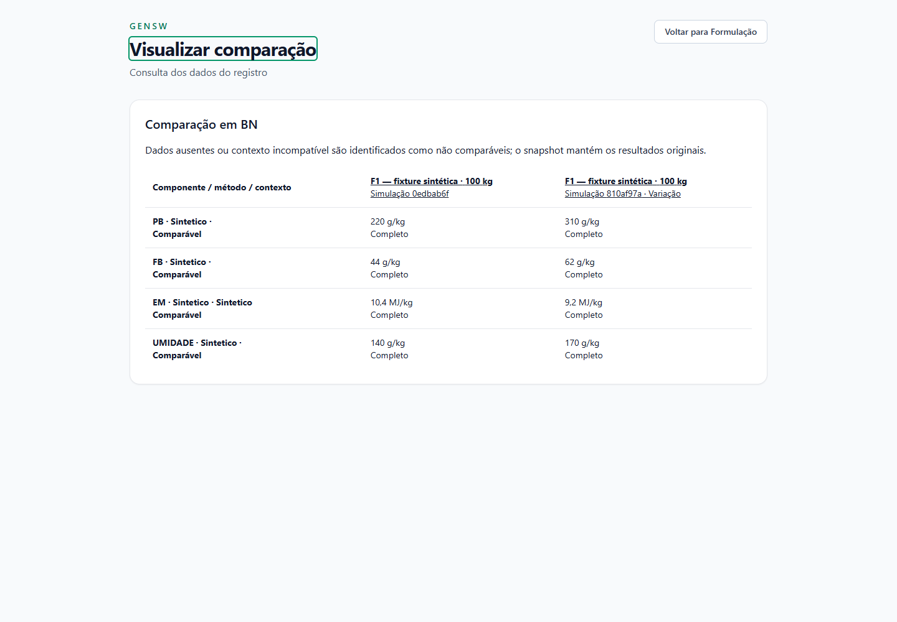
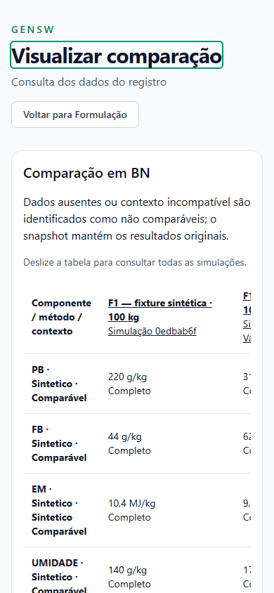

# Validação do MVP-1 — Evolução #413

Implementação autorizada de P01–P05 em 06/10/2026. Tarefa coordenadora [#421](https://devops-lab.tailaf9418.ts.net/issues/421), verticais #422–#426, todas filhas da #413. Branch `codex/421-catalogo-formulacao`, base `origin/main` em `37908e22d0ec5110dfd395bc91ac41d6e7a1df2f`. Os três documentos aprovados foram transferidos do commit documental `286d81f835d4b228c3f95fffc2903e66c7025e7b`, sem merge do PR #19. AGENTS.md e runtime local permanecem fora do Git.

## Gates executados

| Gate | Resultado em 06/10/2026 |
| --- | --- |
| `dotnet restore GenSW.sln` | PASS |
| Build Release da solução | PASS, zero avisos/erros |
| Domínio | PASS, 144 testes |
| Aplicação | PASS, 132 testes |
| Infraestrutura | PASS, 114 testes, PostgreSQL real |
| API | PASS, 151 testes, PostgreSQL real |
| Total backend | 541 aprovados, zero falhas, zero ignorados |
| `npm ci` | PASS, lockfile existente, sem novas dependências |
| Frontend | PASS, 419 testes em 38 arquivos |
| ESLint | PASS, zero avisos |
| TypeScript/Vite build | PASS; aviso de bundle principal acima de 500 kB |

O build/test final usou `--artifacts-path .gensw/final-build`, evitando DLLs em uso na instância HTTPS. Os TRX completos permanecem em runtime local não versionado. Há 28 casos novos de domínio, 12 de API mais preservação de migration, e 11 de frontend. O teste anterior de Propriedades compara agora somente as tabelas existentes antes de sua migration, conservando a verificação de conteúdo e permitindo as tabelas aditivas desta evolução.

Concorrência é validada com duas sessões PostgreSQL efetivamente bloqueadas por uma barreira de advisory lock, observadas em `pg_stat_activity` antes da liberação. Cobertura: código normalizado único, publicações concorrentes de perfil/receita (uma resposta válida e outra 409), replay concorrente do mesmo snapshot, payload divergente 409, falha injetada no histórico com rollback de snapshot/versão, guards de imutabilidade e check de unidade no banco.

## Matriz funcional

| Caso | Evidência executada |
| --- | --- |
| F1: A 60 kg + B 40 kg | PB 220 g/kg BN, FB 44 g/kg, EM 10,4 MJ/kg, MS 86 kg; cálculo e navegador |
| F2: A 30 kg + B 70 kg | PB 310, FB 62, EM 9,2, MS 83 kg; cálculo, snapshot e comparação no navegador |
| PB de B ausente | Total BN/MS nulo, contribuição conhecida 60 g/kg BN, cobertura 60%, meta indeterminada |
| Zero / desconhecido / não aplicável | Zero conhecido é calculável; lacunas e qualificadores não substituem zero |
| BN/MS e energia | Ponderação por massa seca; ausência de MS preserva BN; estimativa de MS propaga política; modalidade/método/contexto incompatíveis não se misturam |
| Metas | Mínimo acima de máximo recusado; PB 450 acima de máximo local 400; limite B ≤20% produz máximo local 160, sem solver |
| Unidades/precisão | g/kg e volume/contagem com conversão explícita; dimensão incompatível, fração de unidade, notação exponencial e mais de seis casas recusadas |
| Escala | Variáveis escalonadas, fixas conservadas; percentuais incorporados exigem soma 100; prévia real 100→200 kg mostrou entradas 120/80 e saída 200 |
| Versões/histórico | Conteúdo publicado imutável; rascunho novo e inativação; snapshots preservados após renomear/inativar item/perfil |
| Sub-receitas | Expansão única, sem dupla contagem; ciclo transitivo pela mesma receita recusado; profundidade 11 e expansão >500 recusadas sem publicação parcial |
| Processamento | 100→90 kg sem dados de saída indeterminado; PB/MS com retenções explícitas estimadas; balanço de massa documentado |
| UI/HTTP | Inativos consultáveis, fontes e zero/lacunas visíveis; 404/403/500, conflito de publicação, retry idempotente, seleção histórica, filtros/paginação |

## Migrações e preservação

`FormulationMigrationTests` migra uma base nova até a main anterior, grava fixtures de Animal, filiação, Cruzamento, Ciclo, Prole, ovo, Propriedade/vínculo e Caixa, captura cada linha JSONB de todas as tabelas anteriores e compara depois da migration aditiva. Nenhuma linha anterior muda. As nove tabelas novas permanecem vazias depois da migration, sem seed nutricional ou entidade de estoque.

Também foi feito `pg_dump` somente de leitura da homologação, restaurado em outro cluster PostgreSQL local. Todas as 30 tabelas existentes conservaram contagens e hashes SHA-256 do conteúdo após as migrations na cópia. Só depois dessa comparação foram inseridas fixtures sintéticas e uma conta de teste na cópia isolada. Banco e sessão do ambiente original não foram alterados.

A base compartilhada continua em `20261002222623_AddFinancialCash`, com schema de Propriedades pendente antes deste trabalho. A cópia recebeu essa migration anterior e `20261006220939_AddCatalogAndFormulation`. Não foi aplicada migration à base compartilhada nem feito deploy. A integração Git foi autorizada posteriormente no aceite abaixo. O [SQL revisável](../operations/sql/2026-10-06-catalogo-formulacao-413.sql) cobre somente esta migration nova, a partir de Propriedades.

## Navegador HTTPS e revisão humana

Ambiente inequívoco da nova funcionalidade: frontend **https://localhost:5175**, API **https://localhost:7005**, banco `gensw_auth_tests` em cluster local exclusivo da validação. As portas 5173/7001 e seus processos originais foram preservados. O ambiente é temporário: o holder local mantém o cluster ativo durante a revisão. Contas existentes foram copiadas sem redefinir senhas; o navegador automatizado usa exclusivamente fixture no ambiente isolado. Nenhuma credencial foi incluída neste relatório.

Chrome autenticado com HTTPS confiável, desktop 1440×1000 e mobile 390×844: menu e rotas, criação de item com capacidades cumulativas, criação/publicação de perfil com zero explícito, receita publicada em leitura, prévia de escala, nova revisão em rascunho, simulação salva pela UI, F1/F2, PB parcial e comparação congelada. Recarregamento da página fez refresh da sessão e `/auth/me` 200. Não houve erro JavaScript nos fluxos concluídos; 401 inicial sem sessão e favicon 404 não são falhas do módulo. Abortos de requisições desmontadas durante navegação/StrictMode foram sucedidos por respostas 200.

Na tela estreita, comparação e detalhe parcial conservaram `scrollWidth = innerWidth = 390`; a tabela comparativa possui região focável e rolagem interna com instrução de deslizar. Screenshots abaixo contêm somente fixtures sintéticas.

Animal, pesagens/filiação, ovos, Propriedades e Caixa foram consultados na cópia, sem gravações nesses módulos. O conteúdo de uma foto privada existente retornou 200 e carregou em 1280×960. Após reiniciar somente a API isolada com os artefatos testados, a configuração explícita de `Images__PrivateRoot` foi preservada; o volume existente não foi copiado, alterado ou substituído. As suítes completas cobrem ainda pedigree, Cruzamentos/Ciclos/Proles e os módulos anteriores.

Roteiro de aceite: entrar em 5175 com uma conta copiada; abrir Insumos e produtos; revisar perfis e suas fontes; abrir Receitas e a versão publicada da fixture; calcular outra escala; abrir Formulação e comparação; comparar F1/F2 e o caso PB ausente; criar sua própria variação documental. Dados sintéticos servem somente para teste e não são recomendação nutricional.

## Aceite e limites do escopo

Em 06/10/2026, após a entrega para revisão, o usuário confirmou: “Validado, pode concluir a tarefa fazer commit, push e merge, deixe sem nenhuma pendencia de governança”. O aceite do MVP-1 e a autorização de integração estão registrados na Tarefa [#427](https://devops-lab.tailaf9418.ts.net/issues/427), filha da #413. O [PR #20](https://github.com/MarcosRCEng/GenSW/pull/20) reúne implementação e planejamento aprovado; o PR documental #19 é substituído por essa entrega. O estado da integração, seus commits e o CI final são verificáveis no PR e nas notas de encerramento do Redmine.

Estoque, vínculo com ovos, custos e solver continuam adiados, fora do aceite do MVP-1. O lock transacional serializa escritas deste MVP; retenção multissaída não é modelada. Os seletores históricos podem apresentar ID enquanto a referência não estiver na página carregada. O build alerta sobre tamanho do bundle; nenhuma dependência foi alterada para tratar trabalho fora do escopo. Publicação em produção/base compartilhada exige decisão posterior, backup e revisão das migrations pendentes; não integra este encerramento.

Commit, push, merge, aceite e resultados de CI são registrados nas Tarefas #421–#427 e no PR de entrega. O encerramento de #413 e das tarefas de preparação/planejamento abrange o trabalho executado e o MVP-1 aprovado; não declara as fases futuras implementadas nem concede autorização para executá-las.
